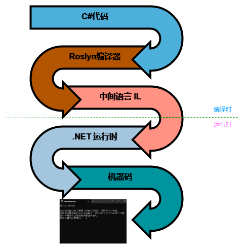
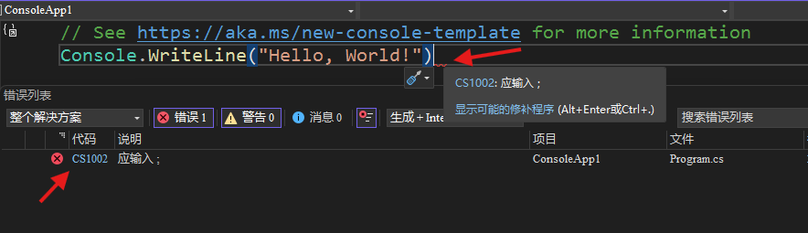
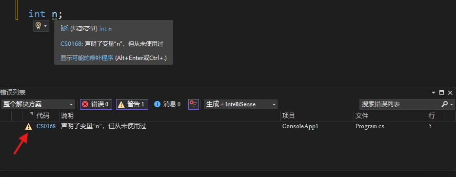

# 0.3 刚刚发生了什么？！


刚刚我一直让你点这个点那个，最后呢，我们得到了一个奇怪的输出结果（黑色框框里面的一行白字），然后我告诉你这是你的第一个App！这看起来和我们日常使用的应用软件没有任何相似之处！好吧，不用感到困惑，通过学习，我们将会不断丰富它的功能。接下来，我们还是先梳理一下刚刚的整个过程到底发生了什么，并且解释几个关键的概念。

其实，编程就是一个让计算机理解并且执行我们设置好的指令的过程。而显然，我们不能使用人类的语言进行沟通：

:open_mouth: : 输出 "hello world".

:computer: : 1011 0101 1001...

:confused: : ???

我们需要一位有能力的翻译来帮助我们和计算机交流！幸运的是，.NET会帮我们做到这点。

我们日常生活中的交流所使用的语言被称作“自然语言”，你现在正在阅读的这篇教程正是用一种自然语言（中文）写成的。人类可以很方便地通过自然语言表达和接收信息，但很难理解机器使用的二进制代码；反过来，对于计算机来说，又很难处理词汇、语法变化多样的自然语言。所以作为一种折衷方案，我们设计了一种受特定规则约束，能同时让人类和计算机都能理解的语言——编程语言。

## 编译时 vs 运行时

当我们写完了代码，然后按下++f5++的时候，实际上有两件事发生了。第一，代码会被翻译成机器码，这叫**编译**。第二，计算机执行机器码，这叫**运行**。

某天早上，当你还在被窝里呼呼大睡时，妈妈出门前给你留了一张字条。你起床后，阅读了字条，然后从微波炉里拿出热好的早餐开始享用。在这个过程中，妈妈想告诉你早餐在微波炉里面，于是她把这个想法（源代码）转化成了写在字条上的文字（机器码）。字条写完以后，妈妈会检查一下有没有写错（比如不小心把“微波炉”写成“冰箱”），如果写错了就改过来。这段时间就叫做**编译时**。你起床后，看见了桌上放着的字条。你读了它，并按照上面说的执行了，拿到了早餐。这段时间就叫做**运行时**。

!!! tip "关于运行时"

    有时我们也把程序运行时提供底层支持的软件——“**运行时环境”**（Runtime Environment）简称为运行时，比如.NET运行时。


#### 测验时间！

A：你打开微波炉发现早餐不见了，这个错误发生在编译时还是运行时？

B：妈妈把字条写成了“微波驴里由早参”，这个错误发生在编译时还是运行时？

??? question "查看答案"

    A：发生在运行时。B：发生在编译时。


## 中间语言 IL

对于一些编程语言来说，编译器会直接把你写的源代码变成机器码，然后装进exe文件里面等等，例如C++就是这样。在你双击exe程序文件以后，里面的机器码就会被加载到内存中，接着计算机开始执行机器代码。然而，C#编译器却会先把你的代码变成一种“**中间语言**（IL）”，然后装进exe或dll文件等。运行程序时，中间语言代码不会直接执行，而是被**公共语言运行时**（CLR）接管，由它来把中间语言翻译为机器代码，然后执行。



那么问题来了，中间语言的存在让编译过程多了一个步骤，它有必要存在吗？

假如另外一天早上，妈妈出门之前想留一张字条说明早餐的位置。但是家里除了你之外，还有一位你的法国朋友。这时妈妈有两个选择。你可能已经想到了一种方案：分别用中文和法语留两张字条，这正是C++编译器所做的。

运行程序的计算机所使用的指令集架构（如x86，x64等等）决定了它能理解的机器码，就像你和你的法国朋友，一个母语是中文，一个母语是法语。所以编译器将为不同的架构生成不同的程序，正如妈妈把自己的想法用不同的语言表达在两张字条上。看到这里，你是否理解了为什么下载某些应用时会询问你需要x86版本的安装包还是x64版本的？

第二种方法呢？妈妈可以用英语留一张字条，而你和你的法国朋友都学习过英语，看到字条后，你们把英语分别翻译为中文和法语，然后都吃到了美味的早餐！是的，之所以能够只用中间语言写一张字条，是因为你和法国朋友都具有把中间语言翻译为自己能理解的语言的能力。

在计算机中提供这种能力的正是公共语言运行时，它的存在让C#代码在编译为中间语言的过程中无需考虑运行平台的架构，只要有相应的公共语言运行时，就能够在不同的平台上运行了。当然，公共语言运行时还有别的作用，我们将在后续的内容中说明。

C#的公共语言运行时在哪里？还记得上一节中，[安装Visual Studio](./L0_02.md/#1-visual-studio)时需要勾选“.NET桌面开发”工作负载，使用Visual Studio Code则要单独[安装.NET SDK](./L0_02.md/#2-net-sdk)吗？是.NET SDK里面的 **.NET运行时** 提供了公共语言运行时。


## 制造你的第一个bug！

回到上一节的最后，我们得到了一个`Program.cs`文件，里面有几行字：

``` cs title="Program.cs" linenums="1"
// See https://aka.ms/new-console-template for more information
Console.WriteLine("Hello, World!");
```

请把第二行末尾的分号删除，像这样：

``` cs hl_lines="2"
// See https://aka.ms/new-console-template for more information
Console.WriteLine("Hello, World!")
```

!!! warning

    请注意，中文的分号`；`和英文的分号`;`是两个不同的字符，对于逗号`，`和`,`、句号`。`和`.`来说也是如此。所以写代码过程中请好好检查是否使用了英文输入法，否则可能引发错误。

!!! note

    如果找不到下图所示的窗口，在Visual Studio中，请点击 `视图` > `错误列表` ，或快捷键 ++ctrl+w++ 然后按下 ++e++ 。在Visual Studio Code中，请点击 `查看` > `打开视图` > `问题` 。




看，删除了分号的位置出现了红色的下划波浪线，提示这里发生了错误。同时错误列表中出现了错误提示，如果把鼠标指针移动到红色波浪线处稍作停留，也会出现类似的提示框。上面写着：

> [CS1002](https://learn.microsoft.com/zh-cn/dotnet/csharp/misc/cs1002?f1url=%3FappId%3Droslyn%26k%3Dk(CS1002)): 应输入;

很显然这条信息在提示你，应该在红色波浪线的位置输入一个分号`;`。在编写代码的时候，你将会遇到各种各样的错误，你可以根据错误的说明来判断如何修改它。错误信息里还有一个编号，例如上面的CS1002。这是一个超链接，点击它可以在浏览器中打开错误的解释页面，从而更好地帮助你理解。



有时错误列表中出现带有黄色感叹号 :warning: 的信息。警告和错误的区别在于，错误通常是严重的问题，会导致程序无法成功编译；而警告的问题不会影响程序编译，但是可能存在潜在问题或者是不规范的用法。警告也有一个编号，点击可以打开解释网页。

刚才我们通过删除了一个分号，从而制造了一个bug，导致代码无法正常编译（可以尝试不顾错误提示启动编译，看看会发生什么？）。你知道这个错误发生在编译时还是运行时吗？

??? question "查看答案"

    发生在编译时。发生在编译时的错误叫做编译时错误，发生在运行时的错误叫做运行时错误。在Visual Studio和Visual Studio Code中，即使没有启动编译，也会展示代码中发现的警告和错误，这个功能是由[IntelliSense](https://learn.microsoft.com/zh-cn/visualstudio/ide/using-intellisense?view=visualstudio)提供的。


好了，带着对C#编译过程的基本理解，我们可以继续编程之旅了！
