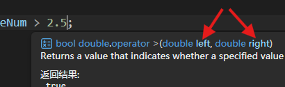

# 1.3 布尔值和条件判断


## 布尔值的类型、声明与赋值

恭喜你掌握了C#中的所有内置数值类型！现在开始，我们转向非数值数据。

条件判断在程序中起着非常重要的作用：程序根据特定条件，可以决定是否允许用户登录、是否加载特定资源、游戏玩家是否获得奖励、监测系统是否发出警报……而这些条件的结果无外乎两种：真（成立）和假（不成立）。在C#中，我们用布尔类型的变量来存储它：

``` cs
bool isActivated = false;

isActivated = true;

Console.WriteLine(isActivated);
```

布尔值的类型、声明与赋值语法和数值类型是一样的套路，只不过它只有两种值——`true`和`false`。可以说，这部分并非难点。

## 比较和相等运算符

之前，我们学习了C#的数值类型。现在让我们看看如何比较数目的大小。在一个应用程序中，只要有未读消息，就在图标右上角显示一个红点提醒用户。

``` cs
int newMessageNum = 4;
bool showRedPoint;

showRedPoint = newMessageNum > 0;
```

看见了吗？在上面的案例中，我们使用了比较运算符 `>` 大于号来判断未读消息数量是否大于0，由此产生了一个布尔类型的比较结果，这个结果最终被赋值给变量`showRedPoint`。如果你感到有些困惑，不妨类比一下`int a = 2 + 3;`中，[加法运算符](./L1_02.md/#_5)的工作原理：把左右两个数相加，得到结果5，然后赋值给变量a。

类似的，还有大于号`>`、小于等于`<=`、大于等于`>=`、不等于号`!=`。如果你是新手，可能要留意一下不等于号的写法。

如果比较一个整型值和一个浮点值，编译器会尝试帮你做隐式类型转换，就和我们在[1.2节](./L1_02.md/#_3)说的那样。想知道类型转换的结果吗？只需把光标停留在运算符上，然后观察出现的提示中left（左操作数）和right（右操作数）的类型即可：



我特意把相等判断留到现在才介绍。你只需记住这些：一个等号是赋值，把右边的值赋予左边，返回赋予的值；两个等号是判断左右两边是否相等，返回是否相等。

``` cs linenums="1"
int a, b;
a = b = 5;

bool isEqual = a == b;
```

请看上例。第2行有两个单等号`=`，它们都是赋值运算符，形成了连续赋值，这点我们[之前](./L1_02.md/#_5)说过了。重点应该在最后一行。我们从右往左看：`a == b`有双等号，是在判断a和b是否相等。这里a和b都是5，因此结果是相等（`true`），这个结果被提供给布尔变量`isEqual`。至此，你能分清`=`和`==`的区别了吗？

## 逻辑运算符

很多商业公司的产品都提供付费服务。假设某流媒体平台需要开发一个高级会员才能解锁的VIP专属免广告功能。用户达到高级会员的条件是连续打卡3个月或者氪金，同时账号不能处于封禁状态。

这里涉及3个条件，我们一个个来看。首先，连续打卡3个月。这个好办，我们定义一个“连续打卡月数”变量，然后用我们刚学会的大于运算符进行比较就可以了：

``` cs
double checkInMonths = 4;
bool isOldUser = checkInMonths > 3;
```

接下来，我们用布尔变量`isPaid`表示用户是否氪金，用`isBanned`表示账号是否被封禁。然后问题就来了，怎么表示“或者”、“同时”的关系？答案是使用逻辑运算符。

`&&`是一个二元运算符，只有两边条件都为`true`的时候才返回`true`，适合用来表示“且”、“同时”等逻辑；而运算符`||`只要两边条件有一边是`true`就返回`true`，适合表达“或”、“只要”等关系。

``` cs
bool isPaid, isBanned;
bool isVip = (isOldUser || isPaid) && isBanned;
```

上面展示的代码使用了括号来确定运算顺序。和你的预期是否一样呢？不一样在哪里？噢！成为会员的条件之一是“账号不能处于封禁状态”，而上面的代码表达的意思实际上是用户打卡或氪金，*而且*账号被封禁！

好吧，看来代码得改成这样：

``` cs
bool isVip = (isOldUser || isPaid) && (isBanned == false);
```

或者，还可以选择使用这个运算符：`!`。它的作用是逻辑取反，人话说就是，在`!condition`中，这个运算符总是返回与`condition`相反的值（注意只是返回相反的值，而不会改变`condition`的值）。因此，下面这样也是可以的：

``` cs
bool isVip = (isOldUser || isPaid) && (!isBanned);
```

在逻辑运算符中，`!`的优先级是最高的，所以右边的括号可以省略：

``` cs
bool isVip = (isOldUser || isPaid) && !isBanned;
```

当然，如果你不确定顺序的话，最好的办法就是加上括号。这样不仅不会给你的程序带来负担，还能增强可读性、避免潜在问题。逻辑运算符的运算优先级见[这里](https://learn.microsoft.com/zh-cn/dotnet/csharp/language-reference/operators/boolean-logical-operators#operator-precedence)。

好了，我们先回到运算符`&&`和`||`这里。假设有一种 真·双色球 彩票，它的规则是：机器里有一些黑色和白色的球，开奖的时候摇出两个小球，只要其中一个是白色的就算中奖。如果你在开奖摇出的第一个球就是白的，那不就可以直接半场开香槟了吗！

很巧，运行时也是这么想的。在`condition1 && condition2`这个表达式中，运行时会先计算`condition1`的值。如果`condition1`是`true`的话，它看都不看`condition2`一眼，直接就返回`true`，然后接着干别的活去了。同样的道理，`condition1 || condition2`中，如果`condition1`是`false`的话，运行时也不会管`condition2`是何方神圣，直接判定为`false`。

那这有什么好处呢？很容易想到的是提升了效率，节省了不必要的操作。同时，考虑以下场景：

公司要给老用户发福利。所有拥有会员资格、而且会员资格时间超过10年的用户，赠送其半年的会员资格。写成代码应该像这样：

``` cs
bool isVip;

bool shouldExtendVipTime = isVip && (VipTime > 10);
```

其中`VipTime`表示会员资格时长，而且只有会员用户才有这个变量。那就有问题了——如果不是会员用户，也许根本就不存在什么`VipTime`了。此时尝试计算右边的表达式必然引发 当前上下文中不存在名称“VipUser” 的错误。

这下，运行时“偷懒”的操作反而救了命：如果`isVip`为`false`，直接忽略右边，从而避免引发错误。而`isVip`为`true`时，能保证`VipTime`存在，右边的表达式可以正常计算。而且从这个例子也能发现，`&&`和`||`运算符左右两边的条件**有时是不能交换**的！我们可以利用右边的条件有时候会被忽略的特性，把比较安全的判断放在左边，有风险的判断放在右边。由此一来，只有左边判断安全了，才会计算右边的条件。

!!! tip

    有没有不管左边结果如何都计算右边条件的运算符呢？<br>
    诶，还真有！它们就是`&`和`|`。上面说的`&&`和`||`运算符的优点反过来就是`&`和`|`的缺点。此外还有一个异或运算符`^`，它的功能和`!=`一样。<br>
    所以，请忘记`&`、`|`和`^`这三个符号的逻辑运算功能吧（是的它们还有别的功能）。

## if 语句

我们在这判断了半天，结果什么都没做？！

嗯，这种尴尬的局面终于要结束了。让我们利用if语句，把前面案例中的操作部分补全。先看未读消息的那个例子。好吧，因为我们现在根本不会设计用户界面（UI），要显示图标、红点什么的简直是痴人说梦。那就暂且用控制台输出消息的形式，假装我们有了一个图形界面（脑补）：

``` cs
int newMessageNum = 4;
bool showRedPoint;

showRedPoint = newMessageNum > 0;

if (showRedPoint)
{
    Console.WriteLine("There's a red point at the icon.");
}
```

研究一下新增代码的结构。它想表达的应该是：`if (showRedPoint)`——如果括号里面的条件（`showRedPoint`）是`true`，就执行花括号`{}`括住的内容。反之，就跳过这部分内容。

那么，现在的未读消息数量是4，尝试运行代码，应该会输出"There's a red point at the icon."。然后，如果把`newMessageNum`设置成0，再次运行代码，会发现没有任何输出。看上去很不错！在这里，条件`showRedPoint`只使用了一次，所以我们也可以不单独声明一个变量来储存它：

``` cs
int newMessageNum = 4;

if (newMessageNum > 0)
{
    Console.WriteLine("There's a red point at the icon.");
}
```

当然咯，假如后续还要用到`newMessageNum > 0`这个条件，最好还是像修改前那样，声明一个变量。OK！我们触及了本教程的首个编程哲学知识——**DRY**(Don't Repeat Yourself)原则。“不要重复你自己”？这是什么意思？

---

#### 编程思维1：DRY原则

在刚刚这个例子里面，假设我们要多次用到`newMessageNum > 0`这个条件。如果我们不辞辛劳，在每个用到的地方都写上`newMessageNum > 0`（也就是“重复你自己”）。然后某一天，老板对你说，我们要改一下这个功能，改成未读消息超过5条才显示红点。这下你就不得不把每个用到这个条件的地方都修改过来，万一哪个地方漏了，就会影响用户体验。

但是，如果我们声明`bool showRedPoint = newMessageNum > 0;`，并且在每个用到这个判断的地方都使用变量`showRedPoint`。这样一来，老板说要修改功能，你就只需改一个地方就好了。减少重复是所谓编程思维的重要组成部分，也将贯穿于后续的教程。

---

现在来看看if-else语句。“红灯停，绿灯行”这句话翻译成C#代码是什么样的：

``` cs
bool isRedLight = true;

if (isRedLight)
{
    Console.WriteLine("停");
}
else
{
    Console.WriteLine("行");
}
```

看起来也很好理解嘛！如果if的那个条件是`true`，就执行`Console.WriteLine("停");`，否则就执行`Console.WriteLine("行");`。这时有个杠精跳出来说：喂喂，那黄灯呢？黄灯你也“行”？好吧，看来我们得这样：

``` cs
bool isRedLight = true;
bool isGreenLight = false;

if (isRedLight)
{
    Console.WriteLine("停");
}
else if (isGreenLight)
{
    Console.WriteLine("行");
}
else
{
    Console.WriteLine("观察");
}
```

上面这段代码其实有两个条件：`isRedLight`和`isGreenLight`。运行时会按顺序检查:

- 如果第一个if的条件（红灯）是真的，就执行对应的代码块（停），然后**跳过**后续所有和这个if匹配的else。
- 如果第一个if的条件（红灯）是假的，那就跳到下一个else if的条件（绿灯）。
- 你可以继续添加else if判断。如果if和所有else if的条件都是假的，最后才会执行else部分的代码块。
- 如果else部分没什么要做的，你可以直接省略else。

上面的代码的意思实际上是：先检查是不是红灯，如果是，就输出“停”，然后结束。如果不是红灯，那再看看是不是绿灯，如果是绿灯就输出“行”。如果既不是红灯也不是绿灯（可能是黄灯，或者信号灯坏了），就输出“观察”。

我们用两个布尔变量分别表示红灯和绿灯的状态。一般情况下，红灯和绿灯不会同时亮起。然而，我们的代码并没有考虑到这层约束。或许我们可以这样定义：

``` cs
bool isRedLight = true;
bool isGreenLight = !isRedLight;
```

这样，我们就保证了红灯亮则绿灯灭，绿灯亮则红灯灭。当我们继续考虑黄灯的情况，事情就变得有些麻烦了。

#### 测验时间

有红、黄、绿三种颜色的信号灯，任意时刻只能亮起一种颜色的灯，请补全if-else语句的条件：

``` cs
bool isRedLight, isYellowLight, isGreenLight;

if (/* 条件1 */)
{
    Console.WriteLine("停");
}
else if (/* 条件2 */)
{
    Console.WriteLine("观察");
}
else if (/* 条件3 */)
{
    Console.WriteLine("行");
}
else
{
    Console.WriteLine("信号灯故障");
}
```

??? question "查看答案"

    - 条件1：`isRedLight && !isYellowLight && !isGreenLight`
    - 条件2：`!isRedLight && isYellowLight && !isGreenLight`
    - 条件3：`!isRedLight && !isYellowLight && isGreenLight`

    （答案不唯一）


---

面对只有3种状态的红绿灯，代码已经变得非常复杂了。万一我们要模拟几十上百种状态的场景，状态之间还有复杂的约束条件，那该是多么令人崩溃啊！

让我们换一个思路。使得代码复杂度上升的根本原因是我们给每种信号灯状态都分别定义了一个布尔变量。那能不能用一个变量表示所有可能的信号灯状态呢？设红灯亮起为`1`，黄灯亮起为`2`，绿灯亮起为`3`行不行呢？当然可以！

``` cs
int lightStatus;

if (lightStatus == 1) // 提醒：两个等号才是相等运算符
{
    Console.WriteLine("停");
}
else if (lightStatus == 2)
{
    Console.WriteLine("观察");
}
else if (lightStatus == 3)
{
    Console.WriteLine("行");
}
else
{
    Console.WriteLine("信号灯故障");
}
```

这下，代码变得清晰多了！而且，就算我们要面对非常多种状态的场景，我们也只需增加`else if (lightStatus == number)`的数量就可以了！

---

#### 编程思维2：高内聚，低耦合

复盘一下。我们一开始用3个独立的布尔变量分别表示3种状态，在判断状态的时候就需要考虑3个变量之间的关系，代码写得很复杂。后来，我们改为用1个整型变量`lightStatus`表示3种状态，通过确认`lightStatus`的数值就能判断所处的状态。

也就是说，1个`lightStatus`聚合了`isRedLight`, `isYellowLight`, `isGreenLight`这3个功能相似的变量，这个过程叫提高**内聚度**。我们从前面使用诸如`isRedLight && !isYellowLight && !isGreenLight`这样的条件表达式判断3个变量之间的（耦合）关系，到只需判断`lightStatus`这1个变量的数值，这个过程叫降低**耦合度**。

嗯！恭喜你又收获了一种编程思维。即使现在不太懂也没关系，我们后面还会用到这个思维的。

---

## switch 语句

刚刚那样，通过很多个if-else语句判断1个变量的值的代码实在是太常用了。你能想到它的一些用处吗？

正因为这种模式很常见，C#为我们提供了一种简化的语法——switch语句。刚刚的红绿灯代码用switch语句重写：

``` cs
int lightStatus;

switch (lightStatus)
{
    case 1:
        Console.WriteLine("停");
        break;
    case 2:
        Console.WriteLine("观察");
        break;
    case 3:
        Console.WriteLine("行");
        break;
    default:
        Console.WriteLine("信号灯故障");
        break;
}
```

怎么？它看起来和之前的if-else语句有点不太一样？我们逐行看看。

首先，`switch (lightStatus)`。switch是开关的意思（不是用来玩游戏的啦！）。在这里，这个开关有点类似于挡位开关。什么的挡位？就是紧随的括号括住的变量的挡位。生活中我们在哪里见过这类开关呢？汽车！没错，那就是`switch (carGear)`。还有电风扇的转速：`switch (fanSpeed)`。

用花括号`{}`括住的内容就是这个开关的详细设计。`case XX:`表示的就是，当开关被拨到XX挡（`case`）的时候，接下来要干什么。我们以`case 1:`为例说明。当`lightStatus == 1`，也就是信号灯状态这个“开关”被拨到`1`的时候，代表了红灯，所以向控制台输出"停"。但……为什么下一行有个`break;`？

试试把`case 1`里的`break;`删除，立刻引发了错误：控制不能从一个 case 标签(“case 1:”)贯穿到另一个 case 标签。咦？什么是“贯穿”？

如果在一个`case`的末尾加上`break;`，当switch语句匹配到这个case以后，执行完case中的代码就会忽略这个switch语句内剩下的代码。也就是说，`break;`起到结束整个switch语句的作用。那不加上`break`呢？执行完这个case后，还会继续检查剩余的其他case，这就是“贯穿”。

什么？还是不懂？好吧。我们假设switch是一个办事大厅，每个case就是一个办事窗口。一般人都是去对应的窗口办完事就离开办事大厅，这就是`break;`的作用。有的人在一个窗口办完事，没人请他离开，他就还会去其他窗口，这就是不写`break;`的后果。

为什么C#禁止“贯穿”呢？这是因为有C++在这方面“坑人”的前车之鉴。在C++里，在窗口办完业务的人，如果你不用`break;`请他离开大厅，他就会立刻化身不良少年，去接下来的窗口挨个骚扰，直到有窗口用`break;`叫他滚蛋，或者他骚扰完所有窗口为止。编译器就在一边看着整个过程发生，而不发出任何警告或错误提示。

所以，在每个`case`的末尾写上`break;`还是很有必要的，包括`default`分支。噢！忘了说了，我们既可以把`case`看成switch办事大厅里的不同窗口，也可以把它们看成switch路口的不同岔路，每一条岔路就叫一个“分支”。假如所有`case`都匹配不上，就会执行默认分支，也就是`default`分支。可以想到，假如所有`case`分支都匹配不上，那一定是发生了一些意料之外的事情。

回到我们的红绿灯代码。我们设计了`case 1`、`case 2`、`case 3`分别代表红灯、黄灯和绿灯3种意料之中的状态。假如它们都不能匹配上，说明这时`lightStatus`可能为`4`、`-100`或者其他乱七八糟的状态，这时就会匹配上`default`分支，输出"信号灯故障"，完美！

!!! tip

    从这个案例也能发现，`default`分支经常被用于处理异常情况。

在C#中只有一种情况允许贯穿，请看下面的代码：

``` cs hl_lines="12 13 15 16"
int lightStatus;

switch (lightStatus)
{
    case 1:
        Console.WriteLine("停");
        break;
    case 3:
        Console.WriteLine("行");
        break;
    case 2:
        Console.WriteLine("观察");
        break;
    default:
        Console.WriteLine("观察");
        break;
}
```

发现case 2这个分支和它的下一个分支执行的操作是一样的。本着DRY原则，C#允许我们把多个操作重复的分支“合并”一下：

``` cs
int lightStatus;

switch (lightStatus)
{
    case 1:
        Console.WriteLine("停");
        break;
    case 3:
        Console.WriteLine("行");
        break;
    case 2:
    default:
        Console.WriteLine("观察");
        break;
}
```

就像上面这样，我们把case 2分支的内容都删掉了。这时，如果`lightStatus`匹配到case 2，就会贯穿到下一个分支，也就是`default`分支，执行`Console.WriteLine("观察");`。这是符合我们预期的行为。

当然，在少数情况下，执行完一个分支以后，如果确实需要接着执行另一个分支，可以使用`goto`语句导航到别的分支，替换原来的`break;`语句。比如`goto case 1;`、`goto default;`这样。

## switch 表达式

表达式和语句的主要区别就是，表达式会产生一个值（计算结果），而语句执行某种操作。一种简单粗暴的检验方法：可以用来赋值的是表达式。

让我们趁机复习一下之前学习的一些语句和表达式吧。比如加法表达式、赋值表达式、自增表达式、逻辑运算表达式等等：

``` cs
int a = 2 + 3;          // 1. 加法表达式

int b;
int c = b = a;          // 2. 赋值表达式

b = a++;                // 3. 自增表达式

bool d = true && false; // 4. 逻辑运算表达式
```

把这些表达式用在赋值语句中，没有引发错误。很好！接着看看if语句：

``` cs
int a = if (true) { 3 }
```

看起来引发了好几个错误呢。这说明if确实是个语句——它执行一定的操作，但是不会返回值。这点和Rust不一样，如果你学过Rust的话，小心别混淆了。

!!! note

    注意到了吗？if语句的末尾没有分号。不要手贱给它加上了。

同样的，赋值语句也不能用于赋值语句中（什么俄罗斯套娃）：

``` cs
int a;
int b = a = 5;; // 其中的a = 5;是赋值语句
```

``` cs
int lightStatus = 1;

string message = 
```
https://learn.microsoft.com/zh-cn/dotnet/csharp/fundamentals/functional/pattern-matching
弃元`_`
https://learn.microsoft.com/zh-cn/dotnet/csharp/fundamentals/functional/discards
## 三元条件运算符


!!! tip "语法糖"

    一些便利程序员的语法设计被称为“语法糖”。

## 局部变量

嵌套、代码块


**挑战1**

声明一个表示月份的变量，分别用if-else语句、switch语句和switch表达式，根据它的值判断这个月有多少天（假设是平年）。

??? note "参考答案"

    分析一下这个问题：结果可能有3种——大月（31天）、小月（30天）和2月（28天）。

    ``` cs
    int month;
    int dayNum;

    if (month == 1 || month == 3 || month == 5 || month == 7 || month == 8 || month == 10 || month == 12)
    {
        dayNum = 31;
    }
    else if (month == 4 || month == 6 || month == 9 || month == 11)
    {
        dayNum = 30;
    }
    else if (month == 2)
    {
        dayNum = 28;
    }
    else
    {
        Console.WriteLine("Invalid month!");
        dayNum = 0;
    }

    Console.Write("This month has ");
    Console.Write(dayNum);
    Console.WriteLine(" days.");
    ```
