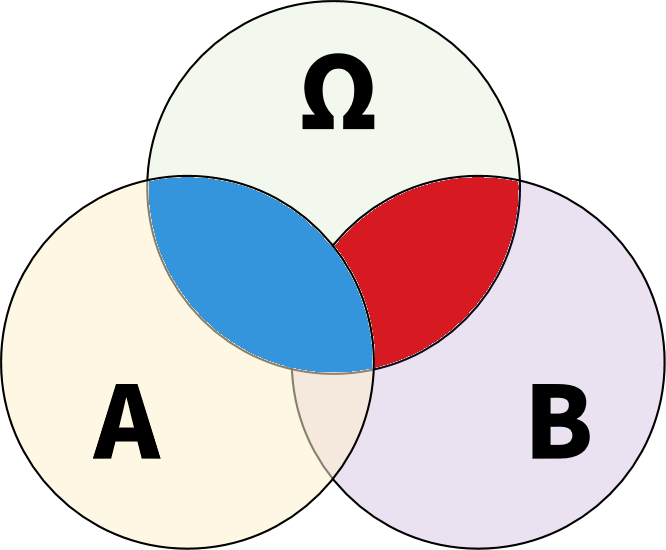
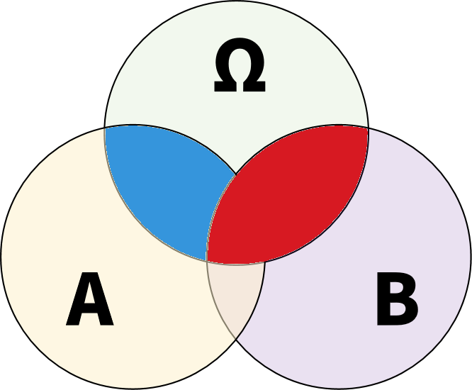

# 1.3.5 【拓展】条件判断


## if语句的骚操作

### 简写法

如果if语句的花括号里面只有一行代码，可以省略花括号：

``` cs
if (showRedPoint)
    Console.WriteLine("There's a red point at the icon.");
```

当然，从代码的易读性考虑，不推荐省略花括号。

!!! note

    简写法的语句不能是声明语句或[带标签的语句]()。

### 把布尔赋值作为if语句的条件

考眼力的时候到了。看看下面的“红灯停”代码：

``` cs hl_lines="3" linenums="1"
bool isRedLight = false;

if (isRedLight = true)
{
    Console.WriteLine("停");
}
```

怎么样，看出来有什么问题了吗？

有没有发现第3行的条件判断少写了一个等号？

那么这是在干什么呢？回忆上一节介绍的二元运算符，一个等号是赋值运算，它把`true`赋予变量`isRedLight`，然后返回`true`。if语句检测到返回的`true`，于是执行`Console.WriteLine("停");`。整套操作完全合法合规，但执行结果和`if (isRedLight == true)`却大相径庭。因此，这很显然是一种极易引发难以察觉的问题的写法。

为了防止新人被坑，C#编译器会抛出一个警告 :warning: CS0665: 条件表达式中的赋值总是常量；是否希望使用 "==" 而非 "="? 来提醒你。

### 被拒绝的隐式转换

还有下面这个：

``` cs hl_lines="1"
int isRedLight = 1;

if (isRedLight)
{
    Console.WriteLine("停");
}
```

非布尔变量能不能作为if语句的判断条件，比如整数？

很遗憾（或者说很幸运？），答案是不能。编译器给了错误提示：无法将类型“int”隐式转换为“bool”。说很幸运是因为，在C++中，编译器会悄悄把非0的`int`变量转换为`bool`值`true`，把0转换为`false`。这种本意是便利开发者的设计与上一个漏写一个等号的行为结合起来，造成了无数逆天bug。

所以C#禁止`int`到`bool`的隐式转换，同时警告把赋值结果用于判断的做法，是C#相对于C++等语言的进步之处的体现。


## switch语句的骚操作

### 为什么case的顺序重要？

我们从集合论的角度研究一下switch语句。考虑如下简单案例：

``` cs
switch(expression)
{
    case A:
        // 执行操作1
        break;
    case B:
        // 执行操作2
        break;
}
```

对于`switch(expression)`，把它判断的这个`expression`的所有可能的情况称为Ω。在第一个case里，如果`expression`匹配情况A（`expression`∈Ω∩A，下图蓝色区域），则执行操作1。如果不匹配情况A，`expression`应为Ω排除A的部分，即Ω\A，这部分再与下一个case，也就是情况B进行匹配。若匹配上（`expression`∈(Ω\A)∩B，下图红色区域），则执行操作2。



将两个case的顺序调换：

``` cs
switch(expression)
{
    case B:
        // 执行操作2
        break;
    case A:
        // 执行操作1
        break;
}
```

操作1（蓝色）和操作2（红色）对应的区域显然发生了变化：



观察造成差异的罪魁祸首，这块区域为A、B所共有。

在常量模式下，A、B无重叠部分（A∩B=Φ），这个罪魁祸首也就消失了。因此，常量模式下case的排列顺序没有关系模式、逻辑模式那么关键。

在关系模式和逻辑模式下，通过合理的条件设置，使得各个case之间互斥，也可以像常量模式那样，减轻case顺序带来的影响。若case之间不得不有交叠，就要特别小心了。

### default的顺序

default分支不是非得排在最后。不管它排第几，它都会在匹配不上其他所有case分支之后才执行。你可以这样写：

``` cs
int lightStatus;

switch (lightStatus)
{
    case 1:
        Console.WriteLine("停");
        break;
    case 2:
        Console.WriteLine("观察");
        break;
    default:
        Console.WriteLine("信号灯故障");
        break;
    case 3:
        Console.WriteLine("行");
        break;
}
```

但习惯上，默认分支一般都写在最后面。（没用的知识+1）

!!! warning

    switch表达式的默认分支必须放在最后面！


## 逻辑模式的骚操作

理论上，逻辑模式和逻辑运算符之间，比较有可能混淆的一点是逻辑运算符对布尔常量做运算：
    
``` cs
true || false
```
    
和逻辑模式连接布尔常量模式：

``` cs
true or false
```

但实际上几乎不会有人这么用。（没用的知识+2）
