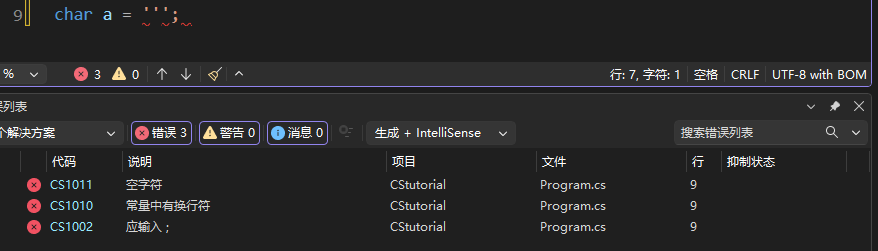
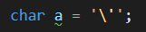
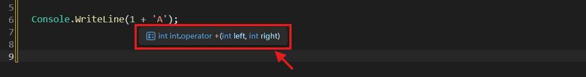
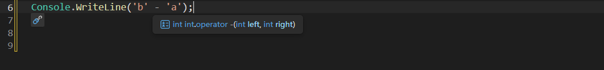

# ⭐ 1.4 字符


## 字符的类型、声明与赋值

上一节可真够长的。没办法——谁让逻辑在程序中扮演了那么重要的角色呢。

让我们转换一下心情，看一种新的类型：字符。

在人类的世界里，我们使用了各种各样的符号来表达我们的意图。这里面包括各种语言的文字、数学符号、排版和制表的符号、表情符号和你从未见过的稀奇古怪符号。

在计算机发展的早期，各家计算机制造商使用各自的字符编码标准，导致计算机之间的通信很困难。为了解决这个问题，美国信息交换标准码（American Standard Code for Information Interchange, ASCII）诞生了。

这套标准涵盖了26个英文字母的大小写、10个阿拉伯数字、常用的英文标点符号，和一些控制打印机用的特殊字符等等。

基于ASCII标准，使用英语以外的其他语言的国家也制定了自己的字符编码规则。这样一来，不同语言的编码互不兼容，造成了乱码问题。

要结束混乱的编码，还得靠一套统一的标准。[Unicode](https://home.unicode.org/)收录了几乎人类使用的几乎所有字符，并给每个字符分配了一个独特的编号。这个编号长这样：大写字母`U`、一个加号`+`，和4~6个十六进制数。

!!! info "码点"

    这个编号叫做“码点”（code point）。

大多数常用字符的编号是4位16进制数。比如大写字母A的编号是：`U+0041`，“人”字的编号是：`U+4EBA`，《易经》的乾卦“☰”的编号是：`U+2630`。对于比较罕见的符号，它们的编号会更长一些。比如emoji符号“😊”的编号是5位数`U+1F60A`。

!!! info

    点击这个[链接](https://www.unicode.org/charts/)查看Unicode的字符表。

字符类型`char`用于储存**单个**Unicode字符。一个`char`类型占用的空间是16bit。算一算，16bit可以表示 0～2<sup>16</sup>-1 的范围，也就是16进制的 0000～FFFF 这个区间。

刚刚说了，这个范围是Unicode中大部分常用字符之所在。如果确实需要表示单个超过这个范围的特殊字符（比如前面说过的emoji等），请使用将在下一节介绍的字符串类型。

`char`类型变量的声明和我们已经学会的其他类型没什么不同：

``` cs
char singleCharacter;
```

值得说道说道的是它的赋值。第一种方法是，我们可以直接把想要的字符打出来，然后用英文单引号`'`包围：

``` cs
char singleCharacter = 'A';
char anotherCharacter = '人';
char guaXiang = '☰';
```

必须强调，`char`类型只能储存**一个**字符，如果像下面这样的话：

``` cs
char a = '有一个人前来买瓜';
```

会引发错误❌CS1012: 字符字面量中的字符太多。

``` cs
char emoji = '😊'; // 超范围的字符
```

尝试让`char`类型的变量储存单个超过`U+0000`~`U+FFFF`范围的字符，也会引起错误❌CS1012: 字符字面量中的字符太多。

空字符也是不行的：

``` cs
char emptyChar = '';
```

错误提示非常简明扼要：❌CS1011：空字符。

有时候，一些字符可能不太好输入。我们可以根据字符的Unicode编号进行输入，格式稍微有点变化——先是一个反斜杠`\`，接着是代表Unicode的小写字母`u`，再然后是四位16进制数。

比如大写字面`A`的字面量是这样：`\u0041`。

!!! tip "“加密通信”"

    打开微信，对某人发送`\u0041`。然后长按这条消息，点“翻译”，你会发现`\u0041`被神奇地翻译为了字母`A`！

    使用更多的Unicode字符编号来发送“暗语”，让你的朋友一头雾水吧！

    

测试一下两种赋值方法是否等效：

``` cs hl_lines="4"
char a = 'A';
char b = '\u0041';

if (a == b)
{
    Console.WriteLine("a is equal to b");
}
```

成功输出了“a is equal to b”，它们确实是等价的！

### 转义

使用第一种方法（直接输入字符）赋值`char`变量的时候，有个很尴尬的字符：英文单引号`'`。你看，

``` cs
char a = ''';
```



出现了好多个错误！这说明`'''`这种写法不能让编译器知道我们想表达单引号`'`的字面量的意思。相反，编译器直接把前两个引号当成一个空字符，引发错误 ❌CS1011：空字符。剩下第三个引号孤苦伶仃。

我们可以用反斜杠`\`来转变字符的含义：

``` cs
char a = '\'';
```

发现了吗，加上反斜杠以后，中间的单引号和反斜杠的颜色变了（网页上可能看不到，请动手在你的IDE输入一下），而且原来的错误信息也消失了。（可能依然有变量未使用的警告）



此时，反斜杠和它后面的单引号构成了一个整体`\'`，这个整体告诉编译器：我是一个单引号字符，而不是起到包裹字符字面量的作用哦，别搞错了！

我们在控制台打印`a`看看：

``` cs
char a = '\'';
Console.WriteLine(a);
```

只有单引号`'`，没有反斜杠。反斜杠只是帮助跟在它后面的字符转变含义的助手。~~（事了拂衣去，深藏身与名）~~

好了，风水轮流转，现在轮到**不起转义作用**的单纯的反斜杠成为最尴尬的字符了：

``` cs
char b = '\';
```

当我们尝试用单引号包围反斜杠字符的时候，反斜杠自动把跟在它后面的单引号转义了。唉，没办法。只能让反斜杠转义反斜杠，告诉编译器，后面那个反斜杠只是单纯的字符，不是要转义谁啦：

``` cs
char b = '\\';
```

搞清楚喽！单引号里面放了两个反斜杠`\\`，但它们只表示**一个**`\`字符。其中，第一个只负责转义，它表示后面那个只是单纯的字符，不想把谁给转义；第二个才是本体。

解决完`'`和`\`的问题后，我们再来看看还有哪些字符能被反斜杠转义吧。

- 小写字母`n`被转义后：`\n`表示换行，效果和你用键盘按一下 ++enter++ 键一样；
- 小写字母`t`被转义后：`\t`表示制表符，效果和你用键盘按一下 ++tab++ 键一样。

#### 测验…哦不，动手时间到！

输入以下代码，测试一下`\n`与`\t`的效果。

``` cs
Console.Write("Hello, ");
Console.Write('\n');
Console.Write("world");
Console.Write('\t');
Console.WriteLine("!!!");
```


## 类型转换

### 从`char`到数值类型

我们已经知道了，`char`类型的变量实际上存储的是字符的Unicode十六进制编号。这个编号的范围是0000～FFFF，换算为十进制就是0～65535。所以，`char`类型天生就适合，也的确可以[隐式转换](./L1_02.md/#隐式转换)为数值类型的变量。前提是：**转换后的类型能表达的范围不应小于0～65535**。

回到本章[第一节](./L1_01.md/#整数的赋值)和[第二节](./L1_02.md/#类型转换)，查阅各种整型类型和浮点类型能表达的范围。你会发现，以下类型的范围不能覆盖0～65535，`char`类型因而不能隐式转换为这些类型：`byte`、`sbyte`和`short`。如果确有需要转换为它们，可以显式转换，但要求你懂得转换机制和风险控制。

从`char`类型到数值类型的转换很有意义。

首先，最直接的应用就是，我们可以方便地获取字符对应的Unicode编号：

``` cs linenums="1"
int codepointOfA = 'A';
Console.WriteLine(codepointOfA);
```

在第1行的赋值语句中，我们就把`'A'`隐式转换为了`int`类型的值，即它的十六进制编号41，对应十进制的65。

**范围比较**可以让我们知道某个字符属于英文字母、数字、汉字，或者别的字符集。就拿英文字母来说吧。我们查阅Unicode字符表，发现大写字母A～Z的编号依次为0041～005A；小写字母a～z的编号依次为0061～007A。有了范围，我们就可以使用逻辑运算符进行判断。

如果你还记得的话，16进制的整数字面量前缀是`0x`：

``` cs hl_lines="3 7"
char a;

if (a >= 0x0041 && a <= 0x005A)
{
    Console.WriteLine("是大写字母");
}
else if (a >= 0x0061 && a <= 0x007A)
{
    Console.WriteLine("是小写字母");
}
else
{
    Console.WriteLine("是其他字符");
}
```

当然，换算成十进制的整数也是可以的。在这里，我们把`char`类型的变量和整数类型进行比较，`char`类型会被隐式转换为整数类型。

可是，我们不太喜欢这种写法。因为，对于不熟悉Unicode编码的人来说，这些`0x0041`、`0x005A`之类的数字就像天书一样——完全看不懂。为了让编写的代码对人类阅读者更友好一些，我们其实可以让`char`和`char`进行比较：

``` cs hl_lines="3 7"
char a;

if (a >= 'A' && a <= 'Z')
{
    Console.WriteLine("是大写字母");
}
else if (a >= 'a' && a <= 'z')
{
    Console.WriteLine("是小写字母");
}
else
{
    Console.WriteLine("是其他字符");
}
```

怎么样？这样一来，代码的意图是不是更明确了？

#### 测验时间

把上一个案例改写为switch语句。

??? question "查看答案"

    ``` cs
    char a;

    switch (a)
    {
        case >= 'A' and <= 'Z':
            Console.WriteLine("是大写字符");
            break;
        case >= 'a' and <= 'z':
            Console.WriteLine("是小写字符");
            break;
        default:
            Console.WriteLine("是其他字符");
            break;
    }
    ```

有了比较和相等运算的示范，我们自然要问：加减运算也可以吗？

先看`char`类型与数值类型的加减法：

``` cs
Console.WriteLine(1 + 'A');
Console.WriteLine('0' - 48);
```

把鼠标指针移动到运算符上，停留一会，查看提示：



字符被隐式转换为数字了，不错。`'A'`（0041）变成了十进制的`65`，加上`1`变成了`66`。字符`'0'`（0030）变成了十进制的`48`，`48 - 48`结果是`0`。

那，字符与字符的加减法，会得到字符？还是数字？

``` cs
Console.WriteLine('b' - 'a');
Console.WriteLine('3' - '2');
```

把鼠标指针停留在运算符上，答案是数字：



利用这个特性，我们可以把字符类型的数字转换为真正的数字！已知字符`'0'`的编号是十进制的`48`，所以`'0' - 48`就可以得到真正的整数`0`。同理，`'1'`的编号是`49`，减去`48`就是数字`1`。以此类推，把`'5'`转换成`5`：

``` cs hl_lines="2"
char digitChar = '5';
int digitValue = a - 48;
```

刚刚说过，我们不喜欢直接写出字符`'0'`的编号`48`。还是这样比较好：

``` cs
char digitChar;
int digitValue = a - '0';
```

最后，别忘了加上范围限定。毕竟我们只想对数字字符进行转换，对别的字符可没兴趣：

``` cs
char digitChar;

if (digitChar >= '0' && digitChar <= '9')
{
    int digitValue = a - '0';
}
```


### 从数值类型到`char`

要想从数值类型转换为`char`类型，只能通过显式转换。这主要是因为大部分数值类型的表达范围都超过了`char`类型的范围，转换过程有数据丢失的风险。

那对于`sbyte`和`ushort`这2类未超出`char`表达范围的类型，为什么也不许隐式转换为`char`？

``` cs
char a = '3';
char b = 3;
```

假如允许隐式转换，上面两种写法都会是合法的。它们之间差异很小，但意思截然不同。对于变量`a`，赋予其字符`'3'`。对于变量`b`，赋予的是Unicode编号为3的字符`\u0003`！

这很可能导致难以察觉的问题。所以C#直接一刀切，禁止从**任何类型**隐式转换为`char`类型。

如果你需要从数值类型转换到字符类型，请使用**显式转换**：

``` cs
char b = (char)3;
```


#### 挑战1

实现一个简单的汉字转拼音功能。

给定一个字符类型的变量，先判断它是否属于中日韩统一字符集（U+4E00 ~ U+9FFF）。如果是的话，用switch语句将其转换为拼音。只需实现“你”、“我”、“山”、“人”、“天”这5个字即可。

??? question "参考答案"

    ``` cs
    char someChar;

    if (someChar >= '\u4E00' && someChar <= '\u9FFF')
    {
        switch (someChar)
        {
            case '你':
                Console.WriteLine("ni");
                break;
            case '我':
                Console.WriteLine("wo");
                break;
            case '山':
                Console.WriteLine("shan");
                break;
            case '人':
                Console.WriteLine("ren");
                break;
            case '天':
                Console.WriteLine("tian");
                break;
            default:
                Console.WriteLine("暂无拼音数据");
                break;
        }
    }
    else
    {
        Console.WriteLine("不是汉字，或者太生僻了");
    }
    ```

    if-else语句也可以并入switch语句。

    ``` cs hl_lines="5"
    char someChar;

    switch (someChar)
    {
        case < '\u4E00' or > '\u9FFF':
            Console.WriteLine("不是汉字，或者太生僻了");
            break;
        case '你':
            Console.WriteLine("ni");
            break;
        case '我':
            Console.WriteLine("wo");
            break;
        case '山':
            Console.WriteLine("shan");
            break;
        case '人':
            Console.WriteLine("ren");
            break;
        case '天':
            Console.WriteLine("tian");
            break;
        default:
            Console.WriteLine("暂无拼音数据");
            break;
    }
    ```

#### 挑战2

给定一个字符，利用switch表达式，判断它是小写英文字母还是大写英文字母；如果是小写就把它转换为大写，大写就转换为小写。

??? question "参考答案"

    大写字母的范围是65～90，小写字母的范围是97～122，二者之间相差32。所以大写字母+32就是小写字母的编号，小写字母-32就是大写字母的编号。还要把编号从数值类型强制转换回字符类型。

    ``` cs
    char letter;

    letter = letter switch
    {
        >= 65 and <= 90 => (char)(letter + 32),
        >= 97 and <= 122 => (char)(letter - 32),
        _ => letter, // 保持原样
    };
    ```

    不想使用整数字面量的话，也可以这样：

    ``` cs
    char letter;
    // 计算'A'到'a'的距离
    int distance = 'a' - 'A';

    letter = letter switch
    {
        >= 'a' and <= 'z' => (char)(letter + distance),
        >= 'A' and <= 'Z' => (char)(letter - distance),
        _ => letter, // 保持原样
    };
    ```
