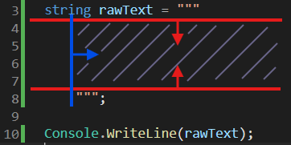
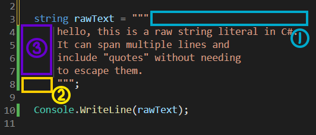
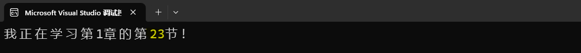
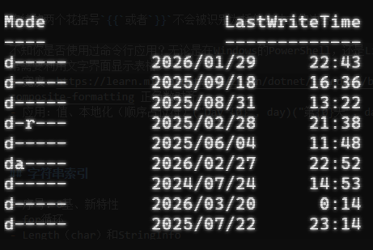
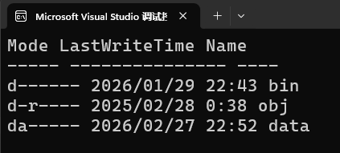
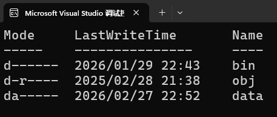

# 1.5 字符串


可能你已经悟出了本章的叙述模式：我们在每节介绍一种新的C#内置类型。在[第一节](./L1_01.md)里详细展示了变量、常量的声明和赋值的机理。此后，我们总是用最快的速度说明新类型的声明和赋值方式，然后尽可能详细地介绍这种类型的特性和用法。是的，这节也是如此。


## 字符串的类型、声明与赋值

想要储存一连串的字符，使用字符串`string`类型再适合不过了。它的声明语句与我们学过的数值类型、布尔类型，又或者是字符类型如出一辙：

``` cs
string a;
```

在上一节，我们啰啰嗦嗦地聊了很多关于字符的字面量的知识。很遗憾，这方面几乎都是硬性规则——也就是告诉你“应该这么做！”，或者“不能那样做！”。而来到本节，字符串的字面量写法更加复杂，但有了上一节的基础，相信你能掌握的！

!!! note

    本节的结构有意安排得和上一节相似。你可以对照上一节，体会`char`类型与`string`类型之间的异同。

### 常规字符串

常规的字符串，也就是最普通的写法，就是用英文双引号`"`包裹字符串内容。我们在hello world代码里就见识过了，只不过那时我们还不知道它的含义。

``` cs
Console.WriteLine("Hello, world!");
```

这里面的`"Hello, world!"`就是一个常规的字符串。我们也可以将它用于赋值：

``` cs
string a = "Hello, world!";

Console.WriteLine(a);
```

如上，先将`"Hello, world!"`字面量赋予`string`类型的变量`a`，再在控制台输出变量`a`，结果依然显示`"Hello, world!"`。

`string`不但支持Unicode编号转义，而且在上一节中超出`char`类型范围的那些Unicode字符也能用`string`轻松表示：

``` cs
string codePoints = "\u0041\u0042\u0043"; // 等价于"ABC"
string signalMessage = "😀👊🔥";
```

`char`不能为空字符，但`string`可以是空字符串：

``` cs
string emptyString = "";
```

另一种表示空字符串的方法是`string.Empty`。注意这里的`Empty`的第一个字母是大写的`E`。这个形式的好处是，比`""`的语义更明确。但缺点是不能用于声明字符串常量（也就是初始化）。

!!! note "复习：常量的初始化"

    常量在编译时完成初始化，因此用于初始化的那个值必须在编译时就要定下来。而`string.Empty`的值在运行时才固定（第3章揭晓原因）。

它俩是相等的：

``` cs
string a = "";
string b = string.Empty;

if (a == b)
{
    Console.WriteLine("a and b are equal");
}
else
{
    Console.WriteLine("a and b are not equal");
}
```

运行上面的代码，将会输出“a and b are equal”。

!!! note "空字符串的用途"

    空的字符串有什么用？或者说，我们什么时候需要一个没有内容的字符串呢？

    当我们预期从某个地方接受一个字符串（比如用户的输入、通过网络获取的信息）的时候，总是有几率无法获得内容。用户可能提交空的表格、网络可能丢包……空字符串非常适合描述这种无内容的情况。

和字符类似，字符串内如果含有双引号或者反斜杠，也需要转义：

``` cs
string a = "What do you \"mean\"?";
string b = "C:\\Program Files\\dotnet\\dotnet.exe";

Console.WriteLine(a);
Console.WriteLine(b);
```

字符串`a`展示了含有双引号的情形。字符串`b`则是包含反斜杠的例子。的确，我们经常能在Windows系统的文件路径字符串中看见反斜杠。忘记使用`\\`的话，会导致路径错误哦！

运行一下上面的案例，看看输出是什么样的。

#### 测验时间

问题1：为什么下面的代码，第3行的`helloMessage`不用加双引号，第4行的`"Hello, World!"`就要加呢？

``` cs linenums="1"
string helloMessage = "Hello, World!";

Console.WriteLine(helloMessage);
Console.WriteLine("Hello, World!");
```

??? question "查看答案"

    因为`helloMessage`是一个字符串类型的变量，储存着`"Hello, World!"`。

    而`"Hello, World!"`是字符串字面量，需要加双引号。

问题2：下面的字符串能正常工作吗？

``` cs
string whiteSpaces = "      ";
string quote1 = "'";
string quote2 = """;
string filePath = "D:\Music\test.wav";
```

??? question "查看答案"

    `whiteSpaces`是一堆空格字符，这是合法的；

    `quote1`是单引号字符，也是合法的；同理，`char a = '"';`也是合法的；

    `quote2`想表达双引号字符，但忘记加反斜杠转义，不能正常工作；

    `filePath`想表达文件路径，但没有用反斜杠转义反斜杠，不能正常工作。

### 逐字字符串

转义转义，整天转义。转得我都烦了！ :anger: 难道就不能双引号里面输入什么就是什么，所见即所得吗？

你需要了解逐字字符串！它会使反斜杠`\`不发挥转义的功能。写法非常简单，只需在字符串前面加一个`@`符号：

``` cs
string verbatimString = @"C:\Program Files\dotnet\dotnet.exe";
```

看见了吗？使用逐字字符串以后，我们再也不需要担心字符串里的反斜杠把什么东西给转义了。所以，我们经常用逐字字符串来写文件路径。非常方便！

!!! note

    它的原理非常简单：就是自动用`\\`替换字面量中的所有`\`。

逐字字符串的第二个好处是，它支持换行。在常规的字符串里，想要换行只能通过`\n`实现。我们以信件的结束语为例，看看这是怎么回事。

``` cs
string endingWord = "    此致\n敬礼";

Console.WriteLine(endingWord);
```

在此致前面，用了一个制表符。你既可以像上面这样直接用 ++tab++ 输入，也可以使用转义的`\t`。此致和敬礼之间用了`\n`来达到换行的效果。OK，输出应该像这样：

``` text
    此致
敬礼
```

换成逐字字符串的话，我们连`\n`都不需要了：

``` cs
string endingWord = @"    此致
敬礼";
```

只需按一下 ++enter++ 就可以让字符串内容也换行了。

不过，如果逐字字符串需要包含双引号的话，为了防止编译器将字符串**内**的引号看作字符串的结束，你得把引号**加倍**：

``` cs
string someText = @"What do you ""mean""?";
```

就像上面展示的字符串，它实际上表示`What do you "mean"?`。以此类推，如果需要2个引号，你就得写4个引号。

### 原始字符串

原始字符串比逐字字符串更加灵活。从它的名字就可以看出来，原始（Raw）表示你输入什么就显示什么，原汁原味。

用连续3个双引号`"""`包裹字符串内容，就得到了一个原始字符串。你可以把字符串写在一行：

``` cs
string rawString = """\n This is a "raw" string! \n""";
Console.WriteLine(rawString);
// 输出：\n This is a "raw" string! \n
```

原始字符串也无视反斜杠转义。并且，由于它通过连续的3个引号`"""`标记起始和结束位置，你可以在内容里自由地使用双引号`"`甚至连续的两个双引号`""`都不会干扰编译器。

!!! tip "万一，只是万一，内容里有连续的三个引号`"""`呢？"

    假设真的遇到这种情况，只需保证**标记原始字符串起、终点的双引号数量超过内容里最多连续双引号的数量**就好。

    假设内容里有连续3个双引号，就应该用连续4个双引号`""""`包围它：`""""There's so many """s in this string!""""`。

这样一来，字符串内容就不能以双引号`"`开头或结尾了。`""""hello""""`会被识别为由4个双引号包围的字符串`hello`，而不是由3个双引号包围的字符串`"hello"`。

想要避开这个限制的话，试试多行写法吧。在多行写法中，原始字符串可以被分为3部分：开始的引号、字符串内容、结束的引号。三个部分需要安排在不同行，像下面这样：

``` cs linenums="1"
string someText = """
hello,
world!
""";
```

开始的引号放在第1行，内容放在2~3行，结束的引号放在第4行。

我们用一张图片说明哪些部分属于字符串内容：



- 开始的引号以下、结束的引号以上，也就是两条**红线之间**的部分；
- 结束的引号左侧的**蓝色线往右**的部分；

而下图标出的这些部分**不是**字符串内容：



- 区域①：开始的引号右侧的部分；
- 区域②：结束的引号左侧的部分；
- 区域③：如图所示。

上述区域可以有空格、制表符，但**不会**计入字符串内容。放置其他任何文本字符都会引发错误，就连注释都不行。

!!! warning "注意对齐"

    区域②和区域③由结束的引号的位置决定。为了对齐，请在这两个区域要么使用制表符，要么使用空格，不用混用。

原始字符串适合储存复杂的文本结构，比如JSON、XML、正则表达式等等。你可以在开始的引号的上一行使用注释`// lang=json`或`// lang=regex`启用JSON或正则表达式的语法高亮。但随着现在的IDE越来越智能化，不使用这个注释也能检测到对应的格式并高亮。

``` cs
// lang=json
string exampleJson = """
    {
        "code": 200,
        "data": {
            "id": 1,
            "title": "原始字符串真好用"
        }
    }
    """;

Console.WriteLine(exampleJson);
```

!!! info "语法高亮"

    你写的代码里面的不同元素被标上了不同的颜色，供你区分。这个功能叫“语法高亮”（Syntax Highlight）。


## 连接字符串

字符串支持的运算符比较有限（本来也没什么可算的）。可以使用运算符`+`可以把两个字符串连接起来：

``` cs
string combinedText = "hello" + "world";
```

最终会得到字符串`helloworld`。变量与字面量、变量之间也可以连接：

``` cs
string a = "hello";

string b = a + "world"; // "helloworld"
string c = a + b;       // "hellohelloworld"
```

连加也是可以的：

``` cs
string message = "hello" + " " + "world" + "!";
```

还记得[复合赋值](./L1_02.md/#_6)吗？

``` cs
string a = "hello";

a += "world";
```

这相当于`a = a + "world";`。

#### 字符串可以连接别的类型吗？

字符串与其他类型连接，如果那些类型可以被“转换”为字符串，就会被“转换”为字符串后再进行连接。

!!! note "提前了解"

    具体来说，就是看那种类型有没有实现`ToString()`方法。如果实现了，就会通过这个方法“转换”为字符串。

``` cs
string a = "hello" + 233;

Console.WriteLine(a);
```

上面这段代码的运算符会把右边的`int`类型字面量`233`，通过`int`类型提供的“转换”为字符串的方法，“转换”为字符串`"233"`。接着与字符串`"hello"`相拼接，得到`"hello233"`。

!!! note "这是类型转换吗？"

    `3 + 2.2`与`"3" + 2.2`的原理有什么区别？

    `3 + 2.2`是`int`类型与`double`类型相加，`int`类型会被临时转换为`double`类型后完成相加。这是我们之前所知道的正宗的隐式转换。

    而`"3" + 2.2`是通过`double`类型提供的转为字符串的**方法**，造出一个字符串`"2.2"`后完成字符串拼接。这个过程中，并没有发生从`double`类型到`string`类型的转换（事实上也不存在这种类型转换）。所以这一切都是通过那个方法（`ToString()`）实现的，不是类型转换。

    因此，这种“转换”被加上了引号，提示你区分它与类型转换。

但是呢，我个人不太喜欢字符串与其他类型的连接。在其他类型比较少的情况下，还比较容易理解：

``` cs
string text = "I am " + 16 + " years old.";
// 得到字符串："I am 16 years old."
```

当其他类型变得更多，代码可能会变得相当令人困惑：

``` cs
string text = "我正在学习第1章的第" + 2 + 3 + "节！";

Console.WriteLine(text);
```

先别运行代码，猜一下会如何输出。会是“我正在学习第1章的第5节！”吗？

答案是：



好家伙，直接从初学者飞升架构师了。虽然我们可以使用括号来改变计算顺序：

``` cs
string text = "我正在学习第1章的第" + (2 + 3) + "节！";
```

但是，C#为我们提供了一种更好用，也更强大的方法——


## 字符串内插

字符串的重要用途之一就是展示信息。很多信息都可以被分为固定部分，以及可变部分。来看一些常见的例子吧。

- 在网页上展示“本网站已经被访问XXX次”
- 邮件系统显示“将在XXX时间定时发送”
- 应用使用方法提示“按XXX键打开XXX功能”
- 游戏显示“你获得了XXX个XXX道具”
- 搜索引擎的智能提示：“猜你想搜：XXX、XXX、XXX”

只要你稍微留意一下现实生活，就能轻松举出100个这样的例子。我们可以用字符串内插，在这些字符串的“XXX”部分插入需要展示的信息。只需2步就能做到：

第一，在字符串的开始的引号前面加上美元符号`$`：

``` cs
// 常规字符串
string a = $"";

// 逐字字符串（以下两种都可以）
string b1 = $@"";
string b2 = @$"";

// 原始字符串
string c = $"""
""";
```

第二，在用花括号`{}`括起可变的部分，在花括号里面尽情写上你想要的任何**表达式**：

``` cs
int numOfVisit = 200000;
string a = $"本网站已经被访问{numOfVisit}次";

double userLv = 234.5;
string b = $"当前经验：{userLv}，距离升级还需{500 - userLv}经验";
```

也可以在字符串里面插入字符串。下面的案例展示了简单的应用信息：

``` cs
const string Version = "1.118.0";

string about = $"""
Visual Studio Code
版本：{Version}
""";
```

三元表达式也是可以的，在需要根据不同条件展示不同信息时很方便：

``` cs
int volume = 80;

Console.WriteLine($"当前音量：{(volume > 0 ? $"{volume}%" : "静音")}");
```

知道这段代码在干什么吗？首先判断当前音量`volume`是否大于0，如果是就显示音量值，否则就显示静音。有趣的是，音量不为0的情况也是一个内插字符串`$"{volume}%"`。可见，内插字符串使用起来相当的灵活，能带给我们很多便利。

唯有一点需要请你记住：因为三元表达式的结构比较复杂，一定要用括号`()`把整个表达式包裹住，编译器才会正确理解。如果忘记这么做的话，会出现错误 ❌CS8361：不可在字符串内插中直接使用条件表达式，因为内插已 “:” 结尾。请用括号将条件表达式括起来。 这条信息已经非常直白地说明了修正方式。

总结一下。在插值字符串中，花括号`{}`是具有特殊功能的符号，在它内部的表达式会被计算。得到的结果如果不是字符串类型，就使用这种类型提供的的`ToString`方法“转换”为字符串。这个字符串再与花括号外部的内容连接起来，形成整体。

和逐字字符串内部的双引号`"`写法类似，如果我们的信息内容中要使用普通的花括号，只需加倍即可。

``` cs
string someText = $"{{商品详情}}";
// 得到字符串："{商品详情}"
```

连续的两个花括号`{{`或者`}}`不会被识别为插值表达式的边界。

不知你是否使用过命令行应用？无论是在Windows的PowerShell，还是Linux系统的各类终端上，它们常常需要利用文字界面显示表格。



不是吧？这么丑陋的“表格”，就连线框都没有。但这已经是早期计算机图形显示技术所能支持的极限了。当初为了用字符来显示线框，人们还制作了各种制表符号。当然，随着表格软件的进化，如今大家更多地把这些符号用来组装昵称和个性签名：`︻┳┱─`（一把枪）。

在制作这种“古董”表格的时候，每个单元格内的信息有可能会不一致，导致整个表格歪歪扭扭：

``` cs
Console.WriteLine($"""
{"Mode"} {"LastWriteTime"} {"Name"}
{"-----"} {"---------------"} {"----"}
""");

Console.WriteLine($"{"d------"} {"2026/01/29 22:43"} {"bin"}");
Console.WriteLine($"{"d-r----"} {"2025/02/28 0:38"} {"obj"}");
Console.WriteLine($"{"da-----"} {"2026/02/27 22:52"} {"data"}");
```

出来的效果是这样的，杂乱无章：



为了对齐列，设置固定的列宽度是很有用的。只需在内插表达式的后面加上一个逗号`,`，然后写上宽度就好了。比如`{"abc", 4}`指定了这个内插值的宽度为4，而它实际上只有`"abc"`这3个字符，不足的部分就会在**左边**填充空格，得到 `" abc"`。

如果你想在右边填充空格，就指定负数宽度：`{"abc", -4}`，它会得到`"abc "`。（也就是左对齐效果）

!!! tip

    如果字符串的实际长度超过了指定宽度也不会截断信息（相当于没指定宽度）。

我们给刚刚的代码补上宽度：

``` cs
Console.WriteLine($"""
{"Mode",-8} {"LastWriteTime",-19} {"Name"}
{"-----",-8} {"---------------",-19} {"----"}
""");

Console.WriteLine($"{"d------",-8} {"2026/01/29 22:43",-19} {"bin"}");
Console.WriteLine($"{"d-r----",-8} {"2025/02/28 21:38",-19} {"obj"}");
Console.WriteLine($"{"da-----",-8} {"2026/02/27 22:52",-19} {"data"}");
```



不错，看起来整齐多了！

!!! tip "复合格式"

    除了宽度以外，你还可以指定其他格式化参数，让你的插值字符串更美观。参见此[文档](https://learn.microsoft.com/zh-cn/dotnet/standard/base-types/composite-formatting)。

插值字符串在多语言应用中特别有用。它可以让翻译工作变得更轻松。在一些西方的语言中，表达第几天的顺序是Day XXX。如果我们用`+`运算符连接的话：

``` cs
int dayNum = 3;
string language = "zh";

string dayText = language switch
{
    "en" => "Day ",
    "fr" => "Jour ",
    "es" => "Día ",
    _ => "Day ", // 默认语言
};

string message = dayText + dayNum;
Console.WriteLine(message);
```

给`dayText`设计一个switch表达式，切换不同语言的文本，就能表达英语的`"Day 3"`，法语的`"Jour 3"`，以及西班牙语的`"Día 3"`了。

但是到了中文就不行了。中文应该是`"第3天"`,天数的前后都有字，不可能通过`dayText + dayNum`的形式表示。难道要为中文单独设计一种表达式吗？这样会导致代码维护起来非常困难。

使用字符串内插，我们只管在字符串里面插入哪些值，把剩下的语序问题交给翻译团队：

``` cs
int dayNum = 3;
string language = "zh";

string message = language switch
{
    "en" => $"Day {dayNum}",
    "fr" => $"Jour {dayNum}",
    "es" => $"Día {dayNum}",
    "zh" => $"第{dayNum}天",
    _ => $"Day {dayNum}"
};

Console.WriteLine(message);
```

让翻译团队设计插值字符串内容，想怎么调整顺序就怎么调整顺序，让用户获得更好的体验。

!!! tip "实际情况"

    考虑到翻译人员不一定会参与代码编写，开发者可以把参数的序号和含义告知翻译者。比如提示文本“{玩家名称}在{几}分钟前加入游戏”，涉及2个参数。从0开始编号，第0个参数是玩家名称，第1个参数是时间。

    译者根据这些信息确定译文，把参数的编号填入对应位置。就像`"{0} joined the game {1} minutes ago"`、`"{0}在{1}分钟前加入游戏"`等等。这些翻译内容会放在一个单独的文档里面，由翻译团队进行维护，与开发团队各司其职，互不干扰。

    现在，应用仅需从翻译文档里面加载本地语言的字符串，再通过`string.Format()`方法，依次填入本地语言字符串、按照顺序排列好的内插参数，就可以组装好完整的字符串了。

    ``` cs
    int joinTime = 3;
    string playerName = "Alice";

    // 模拟加载本地语言字符串
    string localText = "{0}在{1}分钟前加入游戏";

    string Message = string.Format(localText, playerName, joinTime);
    Console.WriteLine(Message);
    ```

!!! info "i18n和l10n"

    i18n即国际化（internationalization，i和n之间有18个字母），就是在程序设计的时候把多语言、多文化显示问题考虑进来。

    l10n即本地化（localization，l和n之间有10个字母），就是把程序内容翻译成本地语言、适配本地文化。例如汉化。


## 字符串索引和范围

“strawberry”这个单词里面有几个字母“r”？这个问题曾经把早期的很多大语言模型难倒了。精确计数不是基于Transformer架构的模型所擅长的事情，但却是我们用C#代码可以轻松做到的。

就像把羊肉串上的肉一块块吃掉一样，我们来看看怎么把字符串里的字符一个个取出来。（好吧，其实只是复制出来而已，字符串保持原样，不会变短🤷‍♂️）

先数一下这个字符串有多长。人工数一下，有10个字母。再用C#代码数一数：

``` cs
string fruit = "strawberry";

Console.WriteLine(fruit.Length);
```

`fruit`是字符串类型的一个实例。所有字符串实例都有一个成员`Length`，储存着这个实例的长度。通过`fruit.Length`就能获取这个字符串的长度信息。输出结果是10，很准确。

!!! info "实例成员和静态成员"

    字符串类型有很多成员，给我们带来了丰富的功能。但不知你有没有发现成员之间的区别：空字符串成员的写法是“类型名.成员”（`string.Empty`），而字符串长度却是“实例名.成员”（`fruit.Length`）。

    假设人类是一种类型，你和我都是这个类型的实例。 ~~（你是AI吗？）~~ 像身高、体重、爱好这样因人而异的属性，更适合与个体（实例）绑定，成为实例成员。我的身高——`我.身高`；你的爱好——`你.爱好`。

    凡人皆有七情六欲。所谓人性是指全人类共有的，不随个体变化而变化的属性。这样的属性与人类这个类型绑定更好，即静态成员。人类的情感——`人类.情感`。

!!! tip "注意写法"

    从现在开始，学习新类型的时候，请注意成员到底是和实例绑定还是和类型绑定哦！

#### 测验时间

判断以下成员是实例成员还是静态成员：

``` cs
// (1)
Console.WriteLine()

// (2)
string a = "hello";
a.Length

// (3)
string.Format()

// (4)
Math.Abs()

// (5)
int b = 3;
b.ToString();
```

??? question "查看答案"

    （1）静态；（2）实例；（3）静态；（4）静态；（5）实例。

怎么样？有难度吗？如果实在搞不清楚的话，可以把鼠标指针停留在句点`.`左边的那个东西上，查看提示。如果是类的话，会像这样，写明了`class`：


如果是实例的话，则会提示说“局部变量”：


### 索引器运算符

回到刚刚的话题。要把哪个字符给取出来呢？还是先给全部字符编个号比较方便。


你看，和前面本地化的案例一样，在计算机程序里，我们总是从0开始编号。这样一来，第1个字母`'s'`的编号是0，第10个字母`'y'`的编号是9。

!!! note "为什么从0开始"

    用过导航软件吗？它是告诉你“请沿当前道路前进500米”，还是“请前进到当前道路的第271公里”？

    字符串是一串连续储存的字符数据。程序总是从开头开始寻找你需要的字符，它更关心从开头*走几步*可以到达那个字符，而不是那是*第几个*字符。对于首个字符，当然是走0步。

取出单个字符的方法很简单：字符串实例的名称+方括号`[]`，方括号内填入字符的编号就好了。现在我要把字符`'a'`取出来，它的序号是3，那就是`fruit[3]`。这个操作会返回一个值，它是一种表达式。同时，方括号`[]`是一种运算符，叫做索引器运算符。

既然是表达式，就能用于赋值。来赋个值看看：

``` cs
char a = fruit[3];

Console.WriteLine(a);
```

没问题，确实把`'a'`给取出来了。

假如一不小心手抖，把编号3写成了30会怎么样？显然这个编号已经超过了字符串的范围，从字符串开头走30步，怕是已经走到别人家了吧。写成这样：

``` cs
char a = fruit[30];
```

诶？编译器怎么没报错？运行一下代码试试。


这是我们遇到的第一个运行时错误！~~可喜可贺~~ 看看错误信息：IndexOutOfRange——索引超过了范围。

!!! note

    和编译错误相比，运行时才会暴露的问题往往更加隐蔽，更难以排查。

在编译期，编译器不知道你这个字符串`fruit`有多长，所以也不会帮你检查索引有没有超过范围。

好吧。那么，怎么把最后一个字母取出来呢？很容易想到的是：

``` cs
char lastChar = fruit[9];
```

不错。但有了刚才的经验，我们发现这个方法并不安全——它的前提是我们已经知道了字符串`fruit`的准确长度，否则极有可能越界。假如我们事先不知道字符串的内容，就应该通过它的长度-1的方式获得最后一个字符的编号：

``` cs
int lengthOfFruit = fruit.Length;
char lastChar = fruit[lengthOfFruit - 1];
```

是的，方括号里面也可以是表达式，反正只要得到一个整数作为索引编号就行。

偶尔这么写写还好，要是我们经常需要字符串的末尾部分（比如研究词性、变形等），那也太麻烦了吧。

### 从末端索引运算符

来看一下从末端开始的编号方法吧：


怎么搞的？刚刚不是还在强调编号从0开始吗，怎么现在又从1开始了？！

重申：计算机不喜欢人类的序号，它只想知道应该走几步才能到。要到达`fruit`末尾的字符，需要从开头走`fruit.Length`步，然后倒退1步。这就是我们刚刚写的代码。

从末端开始的编号就是代表倒退几步，所以是从1开始的。在序号前面加上运算符`^`，表示它是从末尾开始的：

``` cs
char lastChar = fruit[^1];
```

嗯，这写法比刚才简单多了。

#### 测验时间

从两个方向取得`"strawberry"`中的字符`'w'`。

??? question "查看答案"

    ``` cs
    string fruit = "strawberry";

    char w1 = fruit[4];
    char w2 = fruit[^6];
    ```

    别数错就行。

### 范围运算符

既然能取一个字符出来，能不能取一段出来呢？

没问题，让我们使用范围运算符吧！它是两个英文句号`..`。`a..b`就表示一个范围是[a, b)的左闭右开区间。什么意思？这个从`a`到`b`的范围含`a`，不含`b`。

如果你是首次接触编程语言，这个规则还挺奇怪的。请花一段时间适应一下（包括从0开始的编号）。不含`b`的一个好处就是，`b - a`就是这个范围内元素的个数。

用范围`0..3`验证一下：包含0且不含3，就是0、1、2，这三个元素。3 - 0 = 3，对上了。

总之范围运算符大概就是这么个情况。我们把它用在字符串索引，就能取出一段字符（依旧只是复制出来而已）。如果要用一个变量来储存取出来的这段字符，那么变量的类型就得是`string`啦。

把`"strawberry"`的`"raw"`取出来：

``` cs
string fruit = "strawberry";

string fragment = fruit[2..5];
Console.WriteLine(fragment);
```

数一数，`r`的序号是2，`w`的序号是4。要是把范围写成`2..4`的话，就不包含4了。所以应该写成`2..5`才对！

刚学会的从末端开始的索引也可以用在范围运算符中哦。不含最后一个字符的片段范围：`0..^1`，也就是从0开始，直到最后一个字符，且不含最后一个字符。

粗心写反范围的起点和终点会怎么样？

``` cs
string fruit = "strawberry";

string a = fruit[4..3];
Console.WriteLine(a);
```

从4到3的范围……？嗯，看起来这么离谱，哪怕我就是不知道这个字符串有多长，也能一眼发现这里有问题呀。可是，编译器就在一边啥楞着，一声也没吭。直到启动调试：


运行时才发现了这个异常。区间长度3 - 4 = -1。

既然Roslyn不管这档事，检查索引与范围有没有越界的责任自然落到了你的肩上。认真数数、仔细检查吧！

### for循环语句

非常好！我们已经掌握了如何获取一个字符串里的单个字符和一段字符（串）。现在开始数`"strawberry"`单词里面有多少个字母`'r'`？

思路应该是，先来一个计数用的整数变量，把单词里的字符逐个取出，判断它是不是等于`'r'`；是的话，计数器就增加1。

``` cs
int count = 0;
```

计数器已就位。怎么逐个取出字符呢？一个个写的话很麻烦：

``` cs
string fruit = "strawberry";

if (fruit[0] == 'r')
{
    count++;
}
if (fruit[1] == 'r')
{
    count++;
}
// ......
```

#### 思考时间

为什么用连续的if语句，而不是if-else语句？

??? question "参考答案"

    因为我们要把**每个**字符都过一遍。用if-else语句会导致出现首个匹配情况（序号为`2`的那个`'r'`）以后，直接跳过后续所有判断。最终只数到一个`'r'`。

太麻烦了，太重复了，太冗长了！快用for循环语句拯救你的代码！

``` cs
for (/* ① */; /* ② */; /* ③ */)
{
    // ④
}
```

总共有4个部分，先看括号里面的3个。第①部分声明一个[局部变量](./L1_03.md/#_15)，它只在花括号内，也就是第④部分有效。这个变量一般用来指示当前走到了哪里。我们声明一个整数变量`i`，并让它一开始为0。就把`i`当作微信步数好了：

``` cs
for (int i = 0; /* ② */; /* ③ */)
{
    // ④
}
```

为什么叫循环语句？当然是因为花括号里面第④部分要被反复执行。每执行一遍后，就要改变`i`的值。就像每走一步，微信步数就加一。对`i`的改变方式，请填写在第③部分：

``` cs
for (int i = 0; /* ② */; i++)
{
    // ④
}
```

你要是孙大圣，一个筋斗十万八千里也行：

``` cs
for (int i = 0; /* ② */; i += 108000)
{
    // ④
}
```

倒退（`i - 1`）、指数增加（`i *= 2`）什么的也都不在话下。

但是嘛，总不能一直走下去吧。得设置一个停止的条件，写在②这里。比如走两万步就算完成今日锻炼目标：

``` cs
for (int i = 0; i <= 20000; i++)
{
    // ④
}
```

欸欸欸，注意了，填的是`i <= 20000`而不是`i > 20000`。也就是第②部分的条件实际上是**循环继续进行**的条件。

等到第20000次执行完第④部分的代码后，`i`增加1，变为20001，此时就不再满足第②部分的条件`i <= 20000`了，循环结束。

就用for循环来过一遍（又叫“遍历”）我们的草莓字符串！想想括号里的3个部分分别是什么。索引从0开始，这是毋庸置疑的：

``` cs
for (int i = 0; /* ② */; /* ③ */)
{
    // ④
}
```

每次增加1也自不必说：

``` cs
for (int i = 0; /* ② */; i++)
{
    // ④
}
```

循环继续进行的条件是索引没超过界限，也就是：

``` cs
for (int i = 0; i < fruit.Length; i++)
{
    // ④
}
```

为啥是小于长度，而不是小于等于呢？别忘了，我们是从0开始编号，合法的编号是 0 ~ 长度-1 。

在第④部分写上每次循环要进行的操作，也就是检查字符和计数：

``` cs
for (int i = 0; i < fruit.Length; i++)
{
    if (fruit[i] == 'r')
    {
        count++;
    }
}
```

把第`i`个字符取出来，`i`会自动变化，这样就不用我们人力一个个写出来了。太棒了！

附上完整代码，试着运行一下，看看有没有数对：

``` cs
string fruit = "strawberry";

int count = 0;

for (int i = 0; i < fruit.Length; i++)
{
    if (fruit[i] == 'r')
    {
        count++;
    }
}

Console.WriteLine($"The letter 'r' appears {count} times in the word '{fruit}'.");
```

在代码末尾还用了一个插值字符串来更友好地展示结果。看吧，虽然本节知识相对比较枯燥些，但学会了是真的有用！

!!! info

    循环语句也叫迭代语句（iteration statements）。

总的来说，for循环比较麻烦的一点在于要自己设计括号里面的那3个部分。如果搞错了，就有可能会越界。因此，我们不如用foreach循环语句。它没有for语句那么灵活，但更加安全。

``` cs
foreach (/* ① */ in /* ② */)
{
    // ③
}
```

第②部分填上要遍历的对象，foreach循环就会自动遍历整个对象，把它的元素挨个取出来。这个对象当然就是草莓字符串了，

``` cs
foreach (/* ① */ in fruit)
{
    // ③
}
```

取出来以后总要拿个东西接住。就在第①部分声明一个局部变量接着每次循环取出来的元素。就声明一个字符类型的变量`letter`吧：

``` cs
foreach (char letter in fruit)
{
    // ③
}
```

接下来就可以在第③部分对`letter`肆意进行操作了。完全不用担心越界，非常省心。

完整代码：

``` cs
string fruit = "strawberry";

int count = 0;

foreach (char letter in fruit)
{
    if (letter == 'r')
    {
        count++;
    }
}

Console.WriteLine($"The letter 'r' appears {count} times in the word '{fruit}'.");
```

!!! note
    
    有一个上一节遗留下来的问题——如果字符串含有超过`char`类型范围的内容，我们怎么把这样的内容取出来？

    当确有需要时，可以使用[StringInfo](https://learn.microsoft.com/zh-cn/dotnet/api/system.globalization.stringinfo?view=net-10.0)类。它的使用方法超过了本章范围，故不进行介绍。


## 搜索字符串内容

https://learn.microsoft.com/zh-cn/dotnet/csharp/how-to/search-strings

## 修改字符串内容

- 只读性（不可变性）
- https://learn.microsoft.com/zh-cn/dotnet/csharp/how-to/modify-string-contents
截取、替换

## 解析字符串中的数字

https://learn.microsoft.com/zh-cn/dotnet/csharp/programming-guide/strings/how-to-determine-whether-a-string-represents-a-numeric-value
