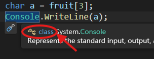
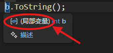
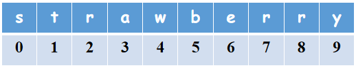
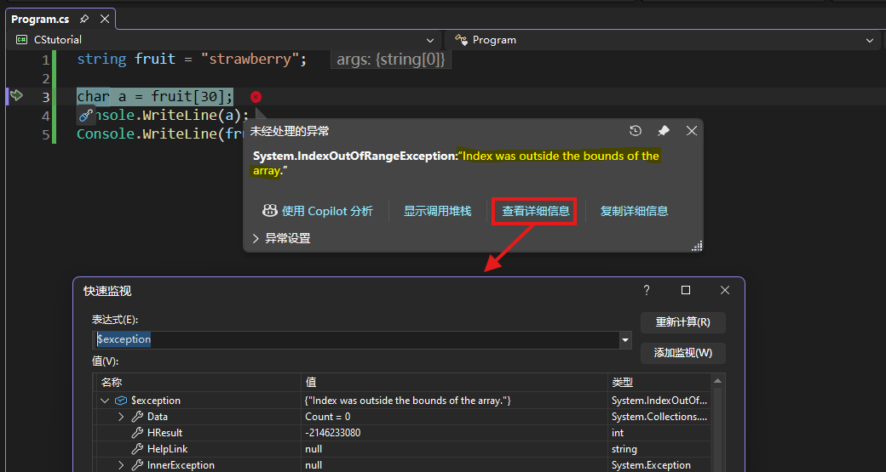
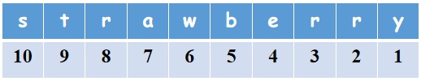
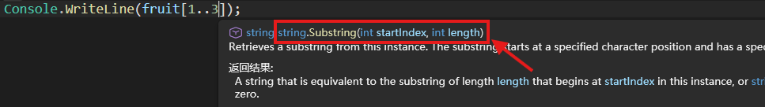
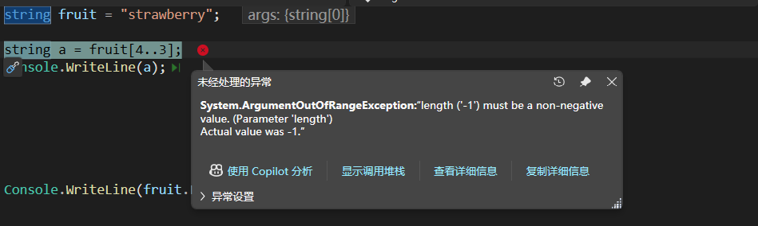

# ⭐ 1.5 字符串（中）

“strawberry”这个单词里面有几个字母“r”？这个问题曾经把早期的很多大语言模型难倒了。精确计数不是基于Transformer架构的模型所擅长的事情，但却是我们用C#代码可以轻松做到的。


## 字符串索引和范围

就像把羊肉串上的肉一块块吃掉一样，我们来看看怎么把字符串里的字符一个个取出来。（好吧，其实只是复制出来而已，字符串保持原样，不会变短🤷‍♂️）

先数一下这个字符串有多长。人工数一下，有10个字母。再用C#代码数一数：

``` cs
string fruit = "strawberry";

Console.WriteLine(fruit.Length);
```

`fruit`是字符串类型的一个实例。所有字符串实例都有一个成员`Length`，储存着这个实例的长度。通过`fruit.Length`就能获取这个字符串的长度信息。输出结果是10，很准确。

!!! info "实例成员和静态成员"

    字符串类型有很多成员，给我们带来了丰富的功能。但不知你有没有发现成员之间的区别：空字符串成员的写法是“类型名.成员”（`string.Empty`），而字符串长度却是“实例名.成员”（`fruit.Length`）。

    假设人类是一种类型，你和我都是这个类型的实例。 ~~（你是AI吗？）~~ 像身高、体重、爱好这样因人而异的属性，更适合与个体（实例）绑定，成为实例成员。我的身高——`我.身高`；你的爱好——`你.爱好`。

    凡人皆有七情六欲。所谓人性是指全人类共有的，不随个体变化而变化的属性。这样的属性与人类这个类型绑定更好，即静态成员。人类的情感——`人类.情感`。

!!! tip "注意写法"

    从现在开始，学习新类型的时候，请注意成员到底是和实例绑定还是和类型绑定哦！

#### 测验时间

判断以下成员是实例成员还是静态成员：

``` cs
// (1)
Console.WriteLine()

// (2)
string a = "hello";
a.Length

// (3)
string.Format()

// (4)
Math.Abs()

// (5)
int b = 3;
b.ToString();
```

??? question "查看答案"

    （1）静态；（2）实例；（3）静态；（4）静态；（5）实例。

怎么样？有难度吗？如果实在搞不清楚的话，可以把鼠标指针停留在句点`.`左边的那个东西上，查看提示。如果是类的话，会像这样，写明了`class`：



如果是实例的话，则会提示说“局部变量”：



### 索引器运算符

回到刚刚的话题。要把哪个字符给取出来呢？还是先给全部字符编个号比较方便。



你看，和前面本地化的案例一样，在计算机程序里，我们总是从0开始编号。这样一来，第1个字母`'s'`的编号是0，第10个字母`'y'`的编号是9。

!!! note "为什么从0开始"

    用过导航软件吗？它是告诉你“请沿当前道路前进500米”，还是“请前进到当前道路的第271公里”？

    字符串是一串连续储存的字符数据。程序总是从开头开始寻找你需要的字符，它更关心从开头*走几步*可以到达那个字符，而不是那是*第几个*字符。对于首个字符，当然是走0步。

取出单个字符的方法很简单：字符串实例的名称+方括号`[]`，方括号内填入字符的编号就好了。现在我要把字符`'a'`取出来，它的序号是3，那就是`fruit[3]`。这个操作会返回一个值，它是一种表达式。同时，方括号`[]`是一种运算符，叫做索引器运算符。

既然是表达式，就能用于赋值。来赋个值看看：

``` cs
char a = fruit[3];

Console.WriteLine(a);
```

没问题，确实把`'a'`给取出来了。

假如一不小心手抖，把编号3写成了30会怎么样？显然这个编号已经超过了字符串的范围，从字符串开头走30步，怕是已经走到别人家了吧。写成这样：

``` cs
char a = fruit[30];
```

诶？编译器怎么没报错？运行一下代码试试。



这是我们遇到的第一个运行时错误！~~可喜可贺🎉~~ 看看错误信息：IndexOutOfRange——索引超过了范围。

!!! note

    和编译错误相比，运行时才会暴露的问题往往更加隐蔽，更难以排查。

在编译期，编译器不知道你这个字符串`fruit`有多长，所以也不会帮你检查索引有没有超过范围。

好吧。那么，怎么把最后一个字母取出来呢？很容易想到的是：

``` cs
char lastChar = fruit[9];
```

不错。但有了刚才的经验，我们发现这个方法并不安全——它的前提是我们已经知道了字符串`fruit`的准确长度，否则极有可能越界。假如我们事先不知道字符串的内容，就应该通过它的长度-1的方式获得最后一个字符的编号：

``` cs
int lengthOfFruit = fruit.Length;
char lastChar = fruit[lengthOfFruit - 1];
```

是的，方括号里面也可以是表达式，反正只要得到一个整数作为索引编号就行。

偶尔这么写写还好，要是我们经常需要字符串的末尾部分（比如研究词性、变形等），那也太麻烦了吧。

### 从末端索引运算符

来看一下从末端开始的编号方法吧：



怎么搞的？刚刚不是还在强调编号从0开始吗，怎么现在又从1开始了？！

重申：计算机不喜欢人类的序号，它只想知道应该走几步才能到。要到达`fruit`末尾的字符，需要从开头走`fruit.Length`步，然后倒退1步。这就是我们刚刚写的代码。

从末端开始的编号就是代表倒退几步，所以是从1开始的。在序号前面加上运算符`^`，表示它是从末尾开始的：

``` cs
char lastChar = fruit[^1];
```

嗯，这写法比刚才简单多了。

#### 测验时间

从两个方向取得`"strawberry"`中的字符`'w'`。

??? question "查看答案"

    ``` cs
    string fruit = "strawberry";

    char w1 = fruit[4];
    char w2 = fruit[^6];
    ```

    别数错就行。

### 范围运算符

既然能取一个字符出来，能不能取一段出来呢？

没问题，让我们使用范围运算符吧！它是两个英文句号`..`。`a..b`就表示一个范围是[a, b)的左闭右开区间。什么意思？这个从`a`到`b`的范围含`a`，不含`b`。

如果你是首次接触编程语言，这个规则还挺奇怪的。请花一段时间适应一下（包括从0开始的编号）。不含`b`的一个好处就是，`b - a`就是这个范围内元素的个数。

用范围`0..3`验证一下：包含0且不含3，就是0、1、2，这三个元素。3 - 0 = 3，对上了。

总之范围运算符大概就是这么个情况。我们把它用在字符串索引，就能取出一段字符（依旧只是复制出来而已）。如果要用一个变量来储存取出来的这段字符，那么变量的类型就得是`string`啦。

把`"strawberry"`的`"raw"`取出来：

``` cs
string fruit = "strawberry";

string fragment = fruit[2..5];
Console.WriteLine(fragment);
```

数一数，`r`的序号是2，`w`的序号是4。要是把范围写成`2..4`的话，就不包含4了。所以应该写成`2..5`才对！

刚学会的从末端开始的索引也可以用在范围运算符中哦。不含最后一个字符的片段范围：`0..^1`，也就是从0开始，直到最后一个字符，且不含最后一个字符。

范围运算符的左操作数和右操作数都是可以省略的。省略左边的数：`..b`表示从开头到`b`（不含`b`）。省略右边的数：`a..`表示从`a`一直到结尾。两边都省略：`..`表示从开头到结尾。就是说，`fruit[..]`把`fruit`字符串的全体都复制出来了。

!!! info "范围索引的本尊"

    把鼠标指针停留在范围索引的方括号`[]`附近，查看提示信息：

    

    怎么出来了一个叫`Substring()`的方法？原来它并不是正经的范围索引，而是悄咪咪地利用范围的开始和结束位置，计算出范围的长度（就是二者相减），然后提供给`Substring()`方法计算！

    罗马不是一天建成的，C#也不是。`Substring()`是一个历史悠久的 ~~老登~~ 方法。后来，为了让C#更现代、更好用，又引入了范围。但是设计者们一拍脑袋：把范围用在字符串索引里不是和`Substring()`功能重复了吗🤔？不如干脆用范围索引的“新瓶”装`Substring()`的“旧酒”吧！

    当然，还是有正经的范围索引的。别着急，在下一章介绍数组的时候你就知道了。

??? tip "隐藏成就"

    不是说`..`是运算符吗？那运算的结果是什么类型的值？如果你能提出这个问题，说明你已经真正掌握了运算符和表达式！恭喜！
    
    范围表达式的结果是`System.Range`类型，它并不属于C#内置类型，也不经常单独拿出来用——毕竟我们总是直接把它塞进索引器的方括号`[]`里面。很少会用到下面这种情况：
    
    ``` cs
    Range a = 1..3;      // 声明并复制Range类型变量
    string b = fruit[a]; // 用于索引
    ```

    类似的，从末端开始的索引是`System.Index`类型，你可以这样声明和赋值：

    ``` cs
    Index i = ^2;
    string c = fruit[i];
    ```

    普通的索引既可以是整数，也可以是`System.Index`类型。既然如此，直接用`int`就好了。

粗心写反范围的起点和终点会怎么样？

``` cs
string fruit = "strawberry";

string a = fruit[4..3];
Console.WriteLine(a);
```

从4到3的范围……？嗯，看起来这么离谱，哪怕我就是不知道这个字符串有多长，也能一眼发现这里有问题呀。可是，编译器就在一边啥楞着，一声也没吭。直到启动调试：



运行时才发现了这个异常。区间长度3 - 4 = -1。

既然Roslyn不管这档事，检查索引与范围有没有越界的责任自然落到了你的肩上。认真数数、仔细检查吧！


## for循环语句

非常好！我们已经掌握了如何获取一个字符串里的单个字符和一段字符（串）。现在开始数`"strawberry"`单词里面有多少个字母`'r'`？

思路应该是，先来一个计数用的整数变量，把单词里的字符逐个取出，判断它是不是等于`'r'`；是的话，计数器就增加1。

``` cs
int count = 0;
```

计数器已就位。怎么逐个取出字符呢？一个个写的话很麻烦：

``` cs
string fruit = "strawberry";

if (fruit[0] == 'r')
{
    count++;
}
if (fruit[1] == 'r')
{
    count++;
}
// ......
```

#### 思考时间

为什么用连续的if语句，而不是if-else语句？

??? question "参考答案"

    因为我们要把**每个**字符都过一遍。用if-else语句会导致出现首个匹配情况（序号为`2`的那个`'r'`）以后，直接跳过后续所有判断。最终只数到一个`'r'`。

太麻烦了，太重复了，太冗长了！快用for循环语句拯救你的代码！

``` cs
for (/* ① */; /* ② */; /* ③ */)
{
    // ④
}
```

总共有4个部分，先看括号里面的3个。第①部分声明一个[局部变量](./L1_03_2.md/#局部变量)，它只在for循环语句内有效。这个变量一般用来指示当前走到了哪里。我们声明一个整数变量`i`，并让它一开始为0。就把`i`当作微信步数好了：

``` cs
for (int i = 0; /* ② */; /* ③ */)
{
    // ④
}
```

为什么叫循环语句？当然是因为花括号里面第④部分要被反复执行。每执行一遍后，就要改变`i`的值。就像每走一步，微信步数就加一。对`i`的改变方式，请填写在第③部分：

``` cs
for (int i = 0; /* ② */; i++)
{
    // ④
}
```

你要是孙大圣，一个筋斗十万八千里也行：

``` cs
for (int i = 0; /* ② */; i += 108000)
{
    // ④
}
```

倒退（`i--`）、翻倍增长（`i *= 2`）什么的也都不在话下。

但是嘛，总不能一直走下去吧。得设置一个停止的条件，写在②这里。比如走两万步就算完成今日锻炼目标：

``` cs
for (int i = 0; i <= 20000; i++)
{
    // ④
}
```

欸欸欸，注意了，填的是`i <= 20000`而不是`i > 20000`。也就是第②部分的条件实际上是**循环继续进行**的条件。

等到第20000次执行完第④部分的代码后，`i`增加1，变为20001，此时就不再满足第②部分的条件`i <= 20000`了，循环结束。

就用for循环来过一遍（又叫“遍历”）我们的草莓字符串！想想括号里的3个部分分别是什么。索引从0开始，这是毋庸置疑的：

``` cs
for (int i = 0; /* ② */; /* ③ */)
{
    // ④
}
```

每次增加1也自不必说：

``` cs
for (int i = 0; /* ② */; i++)
{
    // ④
}
```

循环继续进行的条件是索引没超过界限，也就是：

``` cs
for (int i = 0; i < fruit.Length; i++)
{
    // ④
}
```

为啥是小于长度，而不是小于等于呢？别忘了，我们是从0开始编号，合法的编号是 0 ~ 长度-1 。

在第④部分写上每次循环要进行的操作，也就是检查字符和计数：

``` cs
for (int i = 0; i < fruit.Length; i++)
{
    if (fruit[i] == 'r')
    {
        count++;
    }
}
```

把第`i`个字符取出来，而`i`会自动变化，这样就不用我们人力一个个写出来了。太棒了！

附上完整代码，试着运行一下，看看有没有数对：

``` cs
string fruit = "strawberry";

int count = 0;

for (int i = 0; i < fruit.Length; i++)
{
    if (fruit[i] == 'r')
    {
        count++;
    }
}

Console.WriteLine($"The letter 'r' appears {count} times in the word '{fruit}'.");
```

在代码末尾还用了一个插值字符串来更友好地展示结果。看吧，虽然本节知识相对比较枯燥些，但学会了是真的有用！

!!! info

    循环语句也叫迭代语句（iteration statements）。


## foreach循环语句

总的来说，for循环比较麻烦的一点在于要自己设计括号里面的那3个部分。如果搞错了，就有可能会越界。因此，我们不如用foreach循环语句。它没有for语句那么灵活，但更加安全。

``` cs
foreach (/* ① */ in /* ② */)
{
    // ③
}
```

第②部分填上要遍历的对象，foreach循环就会自动遍历整个对象，把它的元素挨个取出来。这个对象当然就是草莓字符串了，

``` cs
foreach (/* ① */ in fruit)
{
    // ③
}
```

取出来以后总要拿个东西接住。就在第①部分声明一个局部变量接着每次循环取出来的元素。就声明一个字符类型的变量`letter`吧：

``` cs
foreach (char letter in fruit)
{
    // ③
}
```

接下来就可以在第③部分对`letter`肆意进行操作了。完全不用担心越界，非常省心。

完整代码：

``` cs
string fruit = "strawberry";

int count = 0;

foreach (char letter in fruit)
{
    if (letter == 'r')
    {
        count++;
    }
}

Console.WriteLine($"The letter 'r' appears {count} times in the word '{fruit}'.");
```

!!! note
    
    有一个上一节遗留下来的问题——如果字符串含有超过`char`类型范围的内容，我们怎么把这样的内容取出来？

    当确有需要时，可以使用[StringInfo](https://learn.microsoft.com/zh-cn/dotnet/api/system.globalization.stringinfo?view=net-10.0)类。它的使用方法超过了本章范围，故不进行介绍。

就先学到这里。不宜久坐，站起来走几步吧。
