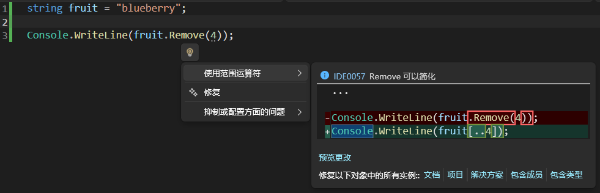

# ⭐ 1.5 字符串（下）

假如开了一家拉面店，然后我们只负责提供煮好的面，顾客需要自备餐具来窗口接面……这是什么画面啊喂！一点服务意识都没有。最基础的餐具和桌椅板凳总得提供给客人吧，甚至还应该备好餐巾纸、酱料、小菜和白开水才对嘛。

同样道理，C#也给字符串类型提供了很多基础、常用的配套功能，方便开发者——也就是你——开展工作。

## 搜索内容

想知道字符串里面是否含有特定内容，可以使用实例方法`Contains()`。

!!! note

    下面介绍的方法都是针对特定字符串实例的。因此，它们都是实例成员。

检查一下笑里有没有藏刀：

``` cs hl_lines="3"
string message = "笑笑笑笑笑笑笑刀笑笑笑笑笑";

if (message.Contains('刀'))
{
    Console.WriteLine("笑里藏刀");
}
```

`Contains()`这个方法会返回一个代表“是否包含要搜索的内容”的布尔值。所以我们可以直接把它用在if语句里面。

`Contains()`不仅能搜索字符，还能搜索字符串。验证一下“要断章取义”是不是出自“不要断章取义”：

``` cs
string message = "不要断章取义";

bool a = message.Contains("要断章取义");
```

如果想知道字符串是否以特定内容开头或结尾，可以使用`StartsWith()`和`EndsWith()`方法。用法都差不多：

``` cs
string website = "www.github.com";

if (website.StartsWith("www"))
{
    Console.WriteLine("这是一个网址");
}

string filePath = "./assets/image.png";

if (filePath.EndsWith(".png"))
{
    Console.WriteLine("这是一个图片");
}
```

在以上代码案例中，想要知道网址是否有效、路径指向的文件类型，通过`StartsWith()`和`EndsWith()`方法来判断是一个不错的选择。

!!! note

    想要使用[正则表达式](https://learn.microsoft.com/zh-cn/dotnet/standard/base-types/regular-expression-language-quick-reference)进行搜索的话，请阅读这个[文档](https://learn.microsoft.com/zh-cn/dotnet/csharp/how-to/search-strings#finding-specific-text-using-regular-expressions)。

## 定位内容

说到位置，我们请草莓再次出山：


想知道`"raw"`在`"strawberry"`的什么位置**首次**出现，就用`IndexOf()`方法：

``` cs
string fruit = "strawberry";

int index = fruit.IndexOf("raw");
Console.WriteLine(index);
```

出现的结果是2，也就是`"raw"`**开头**的字母`'r'`的序号。假如字符串里找不到结果，它会返回`-1`。如果字符串里面找到了多个结果，`IndexOf()`只会返回第一个结果的开头的序号。

相对应的，`LastIndexOf()`会返回找到的最后一个结果的开头的序号；如果找不到，也是返回`-1`。

!!! tip "异常的序号"

    在处理序号或者其他以自然数（0, 1, 2, 3, ...）作为结果的问题时，我们经常用 `-1` 来代表异常情况。

## 修改内容

不知道你有没有看腻strawberry呢？要不要换一种水果试试？换成苹果🍎怎么样？

``` cs
string fruit = "strawberry";

fruit = "apple"; // 🍎
```

这就是对字符串变量的修改——重新赋值。非常简单粗暴，但……如果我只想在原字符串的基础之上进行一些调整，而不是推倒重来，行不行呢？

能不能只修改`strawberry`的`straw`，把它变为`blueberry`呢？

``` cs
string fruit = "strawberry";

fruit[0..5] = "blue";
```

咦——出现了错误 ❌CS0131：赋值号左边必须是变量、属性或索引器。

我们已经知道了变量、字面量和表达式能放在赋值符号`=`的右边。现在，我们也知道赋值号的左边能放什么东西了。知识碎片正在慢慢拼接起来！

我们对给变量赋值已经司空见惯了。属性还没学，先搁一边。至于索引器嘛，只有一次取一个元素出来的才是索引器，范围索引`[0..5]`不算索引器。

好，那我们把野心缩小一点。不是改一段，就用索引器改一个字符可以吗？把结尾的`y`改为`i`：

``` cs
fruit[^1] = 'i';
// 此处是索引器，不会引发CS0131了。
```

诶——又出现了错误 ~~（为什么总是大呼小叫的）~~ ❌CS0200：无法为属性或索引器“string.this[int]”赋值 - 它是只读的。

好了，终于来到了重头戏：字符串具有不可变性。如何理解“不可变”？我们可以把像`fruit`这样的字符串实例理解为一个花盆。

- 通过赋值，你可以在花盆里种植草莓`strawberry`。
- 通过再次赋值，可以把盆子里的草莓拔掉，然后重新种一颗苹果树`apple`。
- 不可以通过魔法把一株草莓直接变成一株蓝莓`blueberry`——你只能先把草莓拔掉再种蓝莓。

就是这样。

难道我们就没有办法把草莓变成蓝莓了吗？非也。请看好下面的过程：

``` cs
string fruit = "strawberry";

string fruit2 = "blue" + fruit[5..];
```

首先，把不需要修改的部分复制出来，也就是`fruit[5..]`。不知你是否还有印象，在上一页的开头，我们就强调过了，字符串的索引和范围索引是复制出一个新字符串（或字符），而不会修改原字符串。所以，这个操作没有违反字符串的不可变性。

然后，我们把`"blue"`与它连接，又得到了一个新字符串`"blueberry"`。在这个操作中，也不会改变`"blue"`或`fruit[5..]`这两个字符串。

最后，把字符串`"blueberry"`赋值给`fruit2`。当然也可以赋值给`fruit`，但那样是腾笼换鸟，而不是修改`"strawberry"`。

以上只是为了方便你理解字符串的不可变性，实际上想要修改字符串内容（注意这里的说法是修改**内容**而不是修改**字符串**）没有那么复杂。我们可以使用`Replace()`方法来替换原字符串中的特定内容，得到一个新字符串，而原字符串的内容*不变*。

``` cs
string fruit = "strawberry";

fruit = fruit.Replace("straw", "blue");
```

`Replace()`方法接受两个字符串，第一个是要替换的内容（`"straw"`），第二个是替换为的内容（`"blue"`）。在这里，我们通过赋值，用新产生的`"blueberry"`字符串顶替了`"strawberry"`，成为了`fruit`的内容。而原来的`"strawberry"`依旧是`"strawberry"`，没有发生改变。只是我们已经不再需要它了，垃圾回收机制会在合适的时候自动清理掉它（后面还会细讲）。

<!-- 补个动图 -->

这个方法有一个经典用途就是屏蔽违禁词：

``` cs
string rawComment = Console.ReadLine();

string healthyComment = rawComment.Replace("傻逼", "**");
Console.WriteLine(healthyComment);
```

在上面的案例中，我们终于见到了`Console.ReadLine()`方法。它会读取用户的输入，直到用户按回车 ++enter++ 为止（不包括这个回车），得到一个字符串。很多教程会在介绍`Console.WriteLine()`的时候一并介绍`Console.ReadLine()`，但我认为在学习了字符串类型以后再介绍它更合适一些。这个案例会引发两个和空值相关的警告，由于我们下一节才学空值，所以暂且忽略它们。

尝试运行一下上面的代码。程序走到`Console.ReadLine()`的时候会停下来，这时你就可以在控制台输入文本。按回车结束输入，程序就会继续运行。


`Replace()`方法非常好用。当替换为的内容是空字符串`""`时，它就变成了删除功能。下面的案例把字符串中的空格统统去除：

``` cs
Console.Write("请输入文本：");
string userInput = Console.ReadLine();

string noWhitespace = userInput.Replace(" ", "");
Console.WriteLine($"用Replace去除空格：{noWhitespace}");
```

注意到了吗？直接来一个`Console.ReadLine()`会什么都不显示就等待用户输入——用户怎么知道要输入什么！所以，我们把`Console.Write()`和`Console.ReadLine()`方法结合起来，先给用户一个提示，告诉用户现在需要输入文本。而且，在输出去除空格后的结果时，还使用了插值字符串，让结果的含义更清楚。

说到空格嘛，有时候我们并不想一棍子打死，把所有空格都去掉。我们可以用`TrimStart()`去掉字符串开头的空格、用`TrimEnd()`去除结尾的空格，或者二合一，用`Trim()`既掐头又去尾。注意这里的去除不是只去除一个，而是把从字符串端部开始到首个不是空格的字符之间的所有空格都去掉。假如我们在字符串`"hello world"`的开头加3个空格，结尾加2个空格：

``` cs
string a = "   hello world  ";

string b1 = a.Trim();
string b2 = a.TrimStart();
string b3 = a.TrimEnd();

Console.WriteLine($"去两头：{b1}；\n去开头：{b2}；\n去结尾：{b3}；");
```

因为空格不是很容易分辨，所以你可以根据插值字符串中的中文冒号和分号来辅助判断这三种方法的效果。

想去除空格以外的字符怎么办？把它们填入这三种方法的括号内就行了：

``` cs
string title = "===Latest News===";
string mainInfo = title.Trim('=');
```

它们在对字符串进行格式化的过程中发挥了重要的作用，可以帮助我们过滤掉位于两端的无用的信息。一次性去掉多种字符也是轻轻松松：

``` cs
string headline = "### 关于我们";
string extractedHeadline = headline.TrimStart(' ', '#');
```

上面这段代码用于提取markdown文档中的标题，它们通常以`#`和空格开头。

`PadLeft()`和`PadRight()`的作用刚好与`TrimStart()`和`TrimEnd()`相反——在开头或结尾填充指定数量的字符。

在字符串`fruit`的开头加2个空格：

``` cs
fruit.PadLeft(2);
```

在末尾加3个感叹号`!`：

``` cs
fruit.PadRight(3, '!');
```

!!! tip

    还记得内插字符串的[宽度格式](./L1_05.md/#设置宽度格式)吗？那里是设置好字符串的总长度后，不够的部分用空格补齐。

!!! tip "使用方法的优先级"

    凭你现在的水平，已经完全可以自己实现`PadLeft()`和`PadRight()`的功能了。那么，现在摆在我们面前就有两个选择：是用C#提供的方法呢，还是自己写一个呢？本着DRY原则，我们应毫不犹豫地选择现成的方法，而不是自己手搓一个一样的。在大多数情况下，我们需要什么功能，总是会先看看有没有人已经把它做出来了，而不是一上来就埋头苦干。但也不尽如此，实际情况有时比我们预想的要复杂。

    在Node.js社区，曾经出现过这样的事件：大量项目依赖于一个第三方提供的“left-pad”方法，突然有一天这个方法不可用，导致依赖它的项目全都无法构建。这也警醒我们，特别重要的功能要么自己实现、自己负责；要么选择可靠的提供者（比如.NET官方、有稳定良好维护记录的第三方）。

在处理一些含有英文的字符串时，大小写可能会产生干扰。很多控制台应用会要求用户输入y表示确定（yes），输入n表示取消（no）。有的用户可能不小心打开了大写锁定，导致程序无法判断。

使用`ToUpper()`和`ToLower()`可以分别把字符串中的英文字母统一为小写或大写，排除干扰。仅限26个英文字母，它不能转换é和É、西里尔字母等等。

``` cs linenums="1" hl_lines="4"
Console.Write("是否继续（y/n）：");
string choice = Console.ReadLine();

choice = choice.Trim().ToLower();

if (choice == "y")
{
    Console.WriteLine("继续");
}
else if (choice == "n")
{
    Console.WriteLine("不继续");
}
else
{
    Console.WriteLine("无效的输入");
}
```

注意第4行，为了省事，我们连续使用了两个方法：先去除`choice`字符串两端的空格，再小写化。得到的新字符串通过赋值回`choice`覆盖掉原字符串。

前面说到可以用`Replace()`方法删除特定内容。不过，还有一个专职的删除特定内容的方法：`Remove()`。它们有什么不同呢？`Replace()`方法是搜索并删除特定内容，而`Remove()`方法是删除特定位置的内容。

具体来说，有两种工作模式。第一种是提供开始序号，它会把从这个序号到字符串结尾的部分删除。要把`"blueberry"`的`"berry"`给删掉，先数`"berry"`开头的字母b序号为4。所以，

``` cs
string fruit = "blueberry";

Console.WriteLine(fruit.Remove(4));
```

这里我为了偷懒，直接把`Remove()`产生的结果提供给了`Console.WriteLine()`。在正式项目中，最好还是用一个变量承接结果，再把变量提供给`Console.WriteLine()`，增强代码的可读性和可复用性。

好了，这时会发现出现了一条来自IDE的提示 ℹ️[IDE0057](https://learn.microsoft.com/zh-cn/dotnet/fundamentals/code-analysis/style-rules/ide0057)：Remove 可以简化。

和错误/警告信息类似，蓝色的编号是超链接，可以点开它的说明页面，查看详细信息。这是一条简化代码的建议，对应代码中划了虚线下划线的部分，即`Remove(4)`的4那里。把鼠标停留在虚线上：



修改建议是使用范围索引。的确，从开头到序号4的范围索引会得到从序号0~序号3的部分，和用`Remove(4)`把序号4及以后的部分删除的效果完全一样。

第二种删除方法是提供开始序号和长度，删除一段内容。把`"blueberry"`的`"blue"`给删掉，应该从序号0开始删，要删除的片段长度为4，

``` cs
string fruit = "blueberry";

Console.WriteLine(fruit.Remove(0, 4));
```

又出现了 ℹ️IDE0057。这次给的简化建议是使用范围索引`fruit[4..]`，原因就不再赘述了。那么，`Remove()`作为范围索引出现前就存在的老资历方法，难道已经英雄迟暮了吗？其实它可以用在删除字符串中间一段内容，这时它就比范围索引更方便了。

和`Remove()`对应的方法是`Insert()`。提供插入位置和插入内容，它就能完成字符串插入操作。在`"blueberry"`的`"blue"`和`"berry"`之间插入`"black"`怎么做？先数插入位置，`"blue"`的最后一个字母e排第3，那插入位置就是4：

``` cs
string fruit = "blueberry";

Console.WriteLine(fruit.Insert(4, "black"));
```

字符串内插是对字符串字面量进行的，而`Insert()`是对字符串实例进行的。

#### 测验时间

[语义化版本](https://semver.org/lang/zh-CN/)（Semantic Versioning, SemVer）的格式为：`主版本号.次版本号.修订号`，比如`0.1.0`。当发布更新时，如果只是做了向下兼容的问题修正，就将修订号增加1，变成`0.1.1`。如果新增了向下兼容的功能，就增加次版本号，变成`0.2.0`。如果发生了不向下兼容的中断性更改，则将主版本号增加1，变成`1.0.0`。如果是测试版本，还可以在后面注明先行版本号：`0.1.0-alpha`。

已知某应用的当前版本是`1.18.3`，请设计更新逻辑。

``` cs
const string Major = "1";
const string Minor = "18";
const string Patch = "3";
```

通常应该联网获取最新版本号，但我们还不会。所以，就简化为用户输入一个版本号吧：

``` cs
string latestVersion = Console.ReadLine();
```

请处理`latestVersion`，如果是测试版（有先行版本号`alpha`或`beta`），就不更新；如果主版本号变更，需要用户确认是否更新；如果次版本号更新，提醒用户注意新功能。

??? question "参考答案"

    先把两头的空格剪掉，再统一一下大小写：

    ``` cs
    latestVersion = latestVersion.Trim().ToLower();
    ```

    检查一下是不是测试版：

    ``` cs
    bool isTestVersion = latestVersion.Contains("alpha") || latestVersion.Contains("beta");
    ```

    通过定位第一个句号，把主版本号给找出来：

    ``` cs
    int firstPeriod = latestVersion.IndexOf('.');
    string latestMajor = latestVersion[..firstPeriod];
    bool isMajorUpdate = Major != latestMajor;
    ```

    下面比较有意思。第二个句号怎么定位？如果版本号里面只含两个句号，那我们可以用`LastIndexOf()`定位。但有时候先行版本号里面也会有句号，虽然这里我们不考虑这种情况，但你也可以思考一下应该怎么处理。

    ``` cs
    int lastPeriod = latestVersion.LastIndexOf('.');
    string latestMinor = latestVersion[(firstPeriod + 1)..lastPeriod];
    bool isMinorUpdate = Minor != latestMinor;
    ```

    至此，我们收集到了足够的信息，可以设计更新逻辑了。

    ``` cs
    if (isTestVersion)
    {
        Console.WriteLine("无需更新");
    }
    else if (isMajorUpdate)
    {
        Console.Write("升级含有中断性变更，是否继续(y/n)：");
        string option = Console.ReadLine();

        if (option.Trim().ToLower() == "y")
        {
            Console.WriteLine("正在更新...");
        }
        else // 安全策略：当用户输入y或Y以外的东西都算取消更新
        {
            Console.WriteLine("已取消更新");
        }
    }
    else
    {
        Console.WriteLine($"正在更新...{(isMinorUpdate ? "（请在更新日志中查看新增功能）" : "")}");
    }
    ```

在参考答案中，我们使用了这样的代码：

``` cs
option.Trim().ToLower() == "y"
```

非常直白地表明了我们把`option`进行裁剪空格和小写化仅仅是为了和`"y"`做比较。.NET一看，说你复制出一个字符串来，就比较一次就扔了？要是字符串很长的话，复制一次很累的哎，太浪费了吧！

所以.NET会给一个性能优化建议 ℹ️CA1862：首选使用“string.Equals(string, StringComparison)”执行不区分大小写的比较，但请记住，这可能会导致行为发生细微变化，因此请确保在应用建议后进行全面测试，或者，如果不需要区分区域性的比较，请考虑使用“StringComparison.OrdinalIgnoreCase”。

!!! info

    编号CA代表代码分析（Code Analysis）。

我们回顾一下本页学习的方法，有哪些是复制出一个字符串，哪些不是？`Replace()`和`PadLeft()`等方法是，而`Contains()`和`IndexOf()`这些不是。

`ToUpper()`和`ToLower()`当然也属于会复制出一个字符串的方法。但和其他同类方法不同，我们经常想用`ToUpper()`和`ToLower()`来得到一个一次性的**中间产物**，用于下一步比较、搜索或定位操作。这样做会造成一些不必要的性能开销。

要在不区分大小写的字符串比较中避免上述问题，可以使用如下的方法：

``` cs
string a = "Hello";
string b = "hello";

bool isEqual = a.Equals(b, StringComparison.OrdinalIgnoreCase);
```

是的，就是如此之长。类似的，如果要进行不区分大小写的搜索，可以在`Contains()`方法中补上这个参数，从而避免使用`ToUpper()`或`ToLower()`：

``` cs
string os = "WINDOWS 11 26H2";

bool IsWindows = os.Contains("win", StringComparison.OrdinalIgnoreCase);
```

话又说回来，如果你的**最终目的**就是获得大/小写化的字符串，那就大胆地用`ToUpper()`和`ToLower()`吧。


