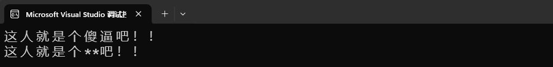

# ⭐ 1.5 字符串（下）

假如开了一家拉面店，然后我们只负责提供煮好的面，顾客需要自备餐具来窗口接面……这是什么画面啊喂！一点服务意识都没有。最基础的餐具和桌椅板凳总得提供给客人吧，甚至还应该备好餐巾纸、酱料、小菜和白开水才对嘛。

同样道理，C#也给字符串类型提供了很多基础、常用的配套功能，方便开发者——也就是你——开展工作。

## 搜索内容

想知道字符串里面是否含有特定内容，可以使用实例方法`Contains()`。

!!! note

    下面介绍的方法都是针对特定字符串实例的。因此，它们都是实例成员。

检查一下笑里有没有藏刀：

``` cs hl_lines="3"
string message = "笑笑笑笑笑笑笑刀笑笑笑笑笑";

if (message.Contains('刀'))
{
    Console.WriteLine("笑里藏刀");
}
```

`Contains()`这个方法会返回一个代表“是否包含要搜索的内容”的布尔值。所以我们可以直接把它用在if语句里面。

`Contains()`不仅能搜索字符，还能搜索字符串。验证一下“要断章取义”是不是出自“不要断章取义”：

``` cs
string message = "不要断章取义";

bool a = message.Contains("要断章取义");
```

如果想知道字符串是否以特定内容开头或结尾，可以使用`StartsWith()`和`EndsWith()`方法。用法都差不多：

``` cs
string website = "www.github.com";

if (website.StartsWith("www"))
{
    Console.WriteLine("这是一个网址");
}

string filePath = "./assets/image.png";

if (filePath.EndsWith(".png"))
{
    Console.WriteLine("这是一个图片");
}
```

在以上代码案例中，想要知道网址是否有效、路径指向的文件类型，通过`StartsWith()`和`EndsWith()`方法来判断是一个不错的选择。

!!! note

    想要使用[正则表达式](https://learn.microsoft.com/zh-cn/dotnet/standard/base-types/regular-expression-language-quick-reference)进行搜索的话，请阅读这个[文档](https://learn.microsoft.com/zh-cn/dotnet/csharp/how-to/search-strings#finding-specific-text-using-regular-expressions)。

## 定位内容

说到位置，我们请草莓再次出山：


想知道`"raw"`在`"strawberry"`的什么位置**首次**出现，就用`IndexOf()`方法：

``` cs
string fruit = "strawberry";

int index = fruit.IndexOf("raw");
Console.WriteLine(index);
```

出现的结果是2，也就是`"raw"`**开头**的字母`'r'`的序号。假如字符串里找不到结果，它会返回`-1`。如果字符串里面找到了多个结果，`IndexOf()`只会返回第一个结果的开头的序号。

相对应的，`LastIndexOf()`会返回找到的最后一个结果的开头的序号；如果找不到，也是返回`-1`。

!!! tip "异常的序号"

    在处理序号或者其他以自然数（0, 1, 2, 3, ...）作为结果的问题时，我们经常用 `-1` 来代表异常情况。

## 修改内容

不知道你有没有看腻strawberry呢？要不要换一种水果试试？换成苹果🍎怎么样？

``` cs
string fruit = "strawberry";

fruit = "apple"; // 🍎
```

这就是对字符串变量的修改——重新赋值。非常简单粗暴，但……如果我只想在原字符串的基础之上进行一些调整，而不是推倒重来，行不行呢？

能不能只修改`strawberry`的`straw`，把它变为`blueberry`呢？

``` cs
string fruit = "strawberry";

fruit[0..5] = "blue";
```

咦——出现了错误 ❌CS0131：赋值号左边必须是变量、属性或索引器。

我们已经知道了变量、字面量和表达式能放在赋值符号`=`的右边。现在，我们也知道赋值号的左边能放什么东西了。知识碎片正在慢慢拼接起来！

我们对给变量赋值已经司空见惯了。属性还没学，先搁一边。至于索引器嘛，只有一次取一个元素出来的才是索引器，范围索引`[0..5]`不算索引器。

好，那我们把野心缩小一点。不是改一段，就用索引器改一个字符可以吗？把结尾的`y`改为`i`：

``` cs
fruit[^1] = 'i';
// 此处是索引器，不会引发CS0131了。
```

诶——又出现了错误 ~~（为什么总是大呼小叫的）~~ ❌CS0200：无法为属性或索引器“string.this[int]”赋值 - 它是只读的。

好了，终于来到了重头戏：字符串具有不可变性。如何理解“不可变”？我们可以把像`fruit`这样的字符串实例理解为一个花盆。

- 通过赋值，你可以在花盆里种植草莓`strawberry`。
- 通过再次赋值，可以把盆子里的草莓拔掉，然后重新种一颗苹果树`apple`。
- 不可以通过魔法把一株草莓直接变成一株蓝莓`blueberry`——你只能先把草莓拔掉再种蓝莓。

就是这样。

难道我们就没有办法把草莓变成蓝莓了吗？非也。请看好下面的过程：

``` cs
string fruit = "strawberry";

string fruit2 = "blue" + fruit[5..];
```

首先，把不需要修改的部分复制出来，也就是`fruit[5..]`。不知你是否还有印象，在上一页的开头，我们就强调过了，字符串的索引和范围索引是复制出一个新字符串（或字符），而不会修改原字符串。所以，这个操作没有违反字符串的不可变性。

然后，我们把`"blue"`与它连接，又得到了一个新字符串`"blueberry"`。在这个操作中，也不会改变`"blue"`或`fruit[5..]`这两个字符串。

最后，把字符串`"blueberry"`赋值给`fruit2`。当然也可以赋值给`fruit`，但那是腾笼换鸟，而不是修改`"strawberry"`。

以上只是为了方便你理解字符串的不可变性，实际上想要修改字符串内容（注意这里的说法是修改**内容**而不是修改**字符串**）没有那么复杂。我们可以使用`Replace()`方法来替换原字符串中的特定内容，得到一个新字符串，而原字符串的内容*不变*。

``` cs
string fruit = "strawberry";

fruit = fruit.Replace("straw", "blue");
```

`Replace()`方法接受两个字符串，第一个是要替换的内容（`"straw"`），第二个是替换为的内容（`"blue"`）。在这里，我们通过赋值，用新产生的`"blueberry"`字符串顶替了`"strawberry"`，成为了`fruit`的内容。而原来的`"strawberry"`依旧是`"strawberry"`，没有发生改变。只是我们已经不再需要它了，垃圾回收机制会在合适的时候自动清理掉它（后面还会细讲）。

<!-- 补个动图 -->

这个方法有一个经典用途就是屏蔽违禁词：

``` cs
string rawComment = Console.ReadLine();

string healthyComment = rawComment.Replace("傻逼", "**");
Console.WriteLine(healthyComment);
```

在上面的案例中，我们终于见到了`Console.ReadLine()`方法。它会读取用户的输入，直到用户按回车 ++enter++ 为止（不包括这个回车），得到一个字符串。很多教程会在介绍`Console.WriteLine()`的时候一并介绍`Console.ReadLine()`，但我认为在学习了字符串类型以后再介绍它更合适一些。这个案例会引发两个和空值相关的警告，由于我们下一节才学空值，所以暂且忽略它们。

尝试运行一下上面的代码。程序走到`Console.ReadLine()`的时候会停下来，这时你就可以在控制台输入文本。按回车结束输入，程序就会继续运行。



`Replace()`方法非常好用。当替换为的内容是空字符串`""`时，它就变成了删除功能。下面的案例把字符串中的空格统统去除：

``` cs
Console.Write("请输入文本：");
string userInput = Console.ReadLine();

string noWhitespace = userInput.Replace(" ", "");
Console.WriteLine($"用Replace去除空格：{noWhitespace}");
```

注意到了吗？直接来一个`Console.ReadLine()`会什么都不显示就等待用户输入——用户怎么知道要输入什么！所以，我们把`Console.Write()`和`Console.ReadLine()`方法结合起来，先给用户一个提示，告诉用户现在需要输入文本。而且，在输出去除空格后的结果时，还使用了插值字符串，让结果的含义更清楚。

说到空格嘛，有时候我们并不想一棍子打死，把所有空格都去掉。我们可以用`TrimStart()`去掉字符串开头的空格、用`TrimEnd()`去除结尾的空格，或者二合一，用`Trim()`既掐头又去尾。注意这里的去除不是只去除一个，而是把从字符串端部开始到首个不是空格的字符之间的所有空格都去掉。假如我们在字符串`"hello world"`的开头加3个空格，结尾加2个空格：

``` cs
string a = "   hello world  ";

string b1 = a.Trim();
string b2 = a.TrimStart();
string b3 = a.TrimEnd();

Console.WriteLine($"去两头：{b1}；\n去开头：{b2}；\n去结尾：{b3}；");
```

因为空格不是很容易分辨，所以你可以根据插值字符串中的中文冒号和分号来辅助判断这三种方法的效果。

想去除空格以外的字符或字符串怎么办？把它们填入这三种方法的括号内就行了：

``` cs
string title = "===Latest News===";
string mainInfo = title.Trim('=');
```

它们在对字符串进行格式化的过程中发挥了重要的作用，可以帮助我们过滤掉位于两端的无用的信息。一次性去掉多种字符也是轻轻松松：

``` cs
string headline = "### 关于我们";
string extractedHeadline = headline.TrimStart(' ', '#');
```

上面这段代码用于提取markdown文档中的标题，它们通常以`#`和空格开头。

!!! info

    `PadLeft()`和`PadRight()`的作用刚好与`TrimStart()`和`TrimEnd()`相反——在开头或结尾填充指定数量的字符。

    在字符串`fruit`的开头加2个空格：`fruit.PadLeft(2);`。

    在末尾加3个感叹号`!`：`fruit.PadRight(3, '!');`。

ToUpper()
ToLower()

前面说到可以用`Replace()`方法删除特定内容。不过，还有一个专职的删除特定内容的方法：`Remove()`。

Insert()

#### 测验时间

已知字符串`"I ate a blueberry yesterday."`。请问我昨天吃了什么？

??? question "查看答案"

    这个问题实际上需要先定位字符串中的内容，然后截取出来。我们可以通过`"ate"`和`"yesterday"`这两个单词定位昨天吃的东西：
    
    ``` cs
    string sentence = "I ate a blueberry yesterday.";

    int startPos = fruit.IndexOf("ate") + "ate".Length;
    int endPos = fruit.LastIndexOf("yesterday");
    ```

    获取首次出现`"ate"`的位置，加上它的长度，就是它结束的位置。

## 解析字符串中的数字

在介绍字符类型的时候，提到过一种比较鸡贼的把数字字符转换为真正的数字的办法：利用数字在Unicode字符表中连续排列的特性，把字符的编号与`'0'`的编号相减。

到了字符串，还用这招就显得捉襟见肘了。我们直接用C#提供的方法：


https://learn.microsoft.com/zh-cn/dotnet/csharp/programming-guide/strings/how-to-determine-whether-a-string-represents-a-numeric-value
