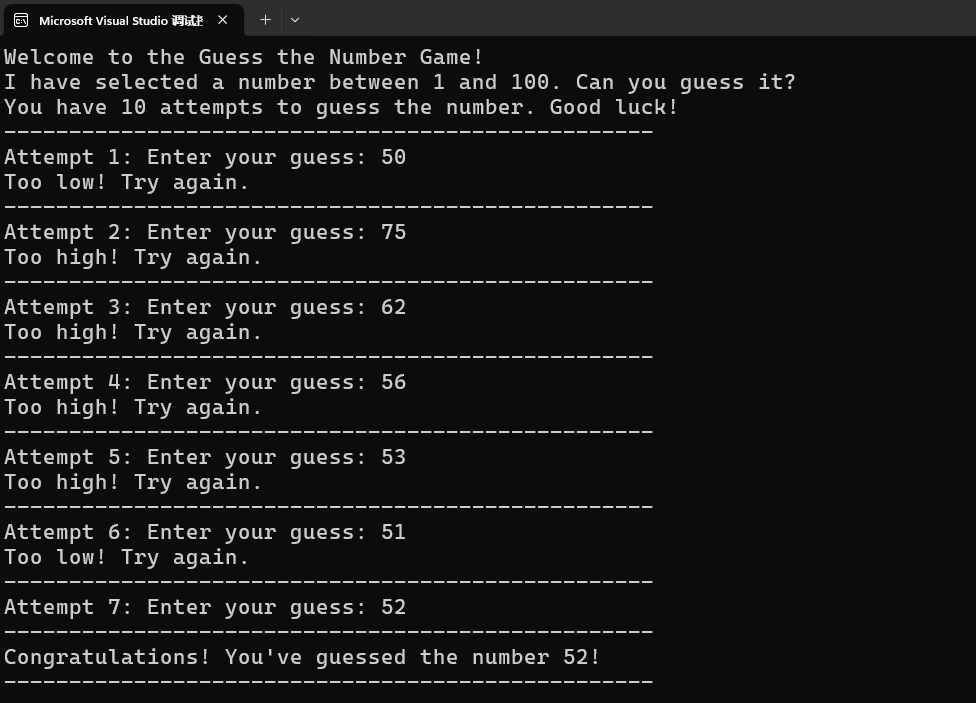

# ⭐ 1.5 字符串（末）

## 解析字符串中的数字

在介绍字符类型的时候，提到过一种比较鸡贼的把数字字符转换为真正的数字的办法：利用数字在Unicode字符表中连续排列的特性，把字符的编号与`'0'`的编号相减。

到了字符串，还用这招就显得捉襟见肘了。我们直接用C#提供的`TryParse()`方法：

``` cs
int a;
string b = "123";

bool result = int.TryParse(b, out a);
```

!!! tip "简化写法"

    注意到 ℹ️IDE0018 了吗？如果在解析字符串`b`之前，承接结果的变量`a`不用干什么的话，可以在`TryParse()`里声明它：

    ``` cs
    bool result = int.TryParse(b, out int a);
    ```

    假如解析失败也不要紧，此时`a`依然可用，值是类型的默认值。`int`类型的默认值是0。

在这里，我们想把字符串`"123"`转换为整数`123`。为此调用了`int`类型的静态方法`TryParse()`。这个方法接受了两个东西，第一个是待转换的字符串`b`，第二个是承接转换结果的变量`a`。而且`a`前面还有一个`out`修饰符。整个方法还会返回一个布尔值，表示转换是否成功。

为什么这个方法长这么奇怪？具体原因我们在第3章会详细介绍。但现在我们可以先推测一下。第一个问题：为什么`TryParse()`不像上一页的那些方法一样，跟字符串实例绑定，而是与转换的目标类型绑定呢？

各管各的好处就是新增类型的时候，由新类型来实现对应的`TryParse()`。否则每加一种类型都要去改`string`类，最终会变成臃肿的屎山。出于同样的理由，实现“[伪类型转换](./L1_05.md/#可以连接别的类型吗)”的那个`ToString()`方法也是各管各的。

下一个问题：为什么解析出来的整数不作为方法的返回值？你别说，`Parse()`方法就是这么设计的：

``` cs
int a;
string b = "123";

a = int.Parse(b);
```

如果解析成功还好。解析失败的话，它会直接抛一个运行时错误出来。不想每次都处理异常的话，还是乖乖地用`TryParse()`吧。你可以根据返回值判断是否解析成功，从而进行应对：

``` cs
int a;
string b = "123#";

bool result = int.TryParse(b, out a);

if (result)
{
    Console.WriteLine(a); 
}
else
{
    Console.WriteLine("解析失败");
}
```

想解析其他数值类型？依葫芦画瓢就行：

``` cs
string b = "123.4";

bool result = double.TryParse(b, out double a);
```

## 用字符构造字符串

有些编程语言支持通过字符与整数“相乘”构造由若干个该字符组成的字符串，例如`'a' * 3`会得到字符串`"aaa"`。在C#中，虽然不支持这种运算，但我们可以这样：

``` cs
string text = new('a', 3);
```

`new()`是`new string()`的简写，这个方法会创建一个字符串实例。`new('a', 3)`就表示创建3个字符`'a'`组成的字符串`"aaa"`。

## 猜数字游戏

我知道这个案例很老套。但是……就它吧。

先把玩法介绍打在公屏上：

``` cs
Console.WriteLine("Welcome to the Guess the Number Game!");
Console.WriteLine("I have selected a number between 1 and 100. Can you guess it?");
Console.WriteLine("You have 10 attempts to guess the number. Good luck!");
```

接下来，从1~100之间随机挑一个数字作为答案：

``` cs
int numberToGuess = new Random().Next(1, 101);
```

`Random`是用于生成随机数的类，我们后面有机会再详细聊它。现在只需照抄上面的代码就行。

先来一个布尔变量记录玩家有没有猜中，游戏结束后据此输出结算话语：

``` cs
bool isGuessed = false;
```

只给玩家10次猜测的机会。用一个for循环把猜测环节套住：

``` cs
for (int attempt = 1; attempt <= 10; attempt++)
{
}
```

每轮猜测先提示玩家现在是第几轮，请玩家输入数字：

``` cs
for (int attempt = 1; attempt <= 10; attempt++)
{
    Console.Write($"Attempt {attempt}: Enter your guess: ");
    string userInput = Console.ReadLine();
}
```

尝试解析玩家的输入，如果解析失败要提示玩家输入数字：

``` cs
for (int attempt = 1; attempt <= 10; attempt++)
{
    Console.Write($"Attempt {attempt}: Enter your guess: ");
    string userInput = Console.ReadLine();

    bool isNum = int.TryParse(userInput, out int guessedNumber);

    if (isNum)
    {
    }
    else
    {
        Console.WriteLine("Invalid input. Please enter a number.");
    }
}
```

如果解析成功，把解析结果`guessedNumber`与答案`numberToGuess`进行比较。如果有偏差，提醒玩家调整；如果猜中了，就把`isGuessed`设置为`true`，然后结束循环。

``` cs
for (int attempt = 1; attempt <= 10; attempt++)
{
    Console.Write($"Attempt {attempt}: Enter your guess: ");
    string userInput = Console.ReadLine();

    bool isNum = int.TryParse(userInput, out int guessedNumber);

    if (isNum)
    {
        if (guessedNumber == numberToGuess)
        {
            isGuessed = true;
            break;
        }
        else if (guessedNumber < numberToGuess)
        {
            Console.WriteLine("Too low! Try again.");
        }
        else
        {
            Console.WriteLine("Too high! Try again.");
        }
    }
    else
    {
        Console.WriteLine("Invalid input. Please enter a number.");
    }
}
```

最后，根据`isGuessed`确定玩家输赢：

``` cs
if (isGuessed)
{
    Console.WriteLine($"Congratulations! You've guessed the number {numberToGuess}!");
}
else
{
    Console.WriteLine($"Sorry, you've used all 10 attempts. The number was {numberToGuess}. Better luck next time!");
}
```

为了让输出更井井有条，我们在每轮之间输出一个分界线。用`new()`来构造分界线字符串：

``` cs
string divider = new('-', 50);
```

以下是完整代码：

``` cs
// Guess the number

int numberToGuess = new Random().Next(1, 101);

Console.WriteLine("Welcome to the Guess the Number Game!");
Console.WriteLine("I have selected a number between 1 and 100. Can you guess it?");
Console.WriteLine("You have 10 attempts to guess the number. Good luck!");

bool isGuessed = false;

string divider = new('-', 50);

for (int attempt = 1; attempt <= 10; attempt++)
{
    Console.WriteLine(divider);
    Console.Write($"Attempt {attempt}: Enter your guess: ");
    string userInput = Console.ReadLine();

    bool isNum = int.TryParse(userInput, out int guessedNumber);

    if (isNum)
    {
        if (guessedNumber == numberToGuess)
        {
            isGuessed = true;
            break;
        }
        else if (guessedNumber < numberToGuess)
        {
            Console.WriteLine("Too low! Try again.");
        }
        else
        {
            Console.WriteLine("Too high! Try again.");
        }
    }
    else
    {
        Console.WriteLine("Invalid input. Please enter a number.");
    }
}

Console.WriteLine(divider);

if (isGuessed)
{
    Console.WriteLine($"Congratulations! You've guessed the number {numberToGuess}!");
}
else
{
    Console.WriteLine($"Sorry, you've used all 10 attempts. The number was {numberToGuess}. Better luck next time!");
}

Console.WriteLine(divider);
```

爽快开玩：


