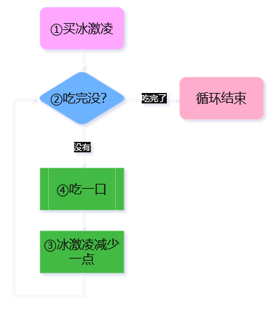

# 🔍 1.5.5 for循环语句

## 拓展设计思路

依然是草莓字符串`"strawberry"`。现在我想知道，最后一个`'r'`的序号是多少？

这还用问？难道不是直接用`LastIndexOf('r')`一招秒了吗？

想得美，没那么简单！在本节，禁止使用`LastIndexOf()`！

### 开倒车①

即使不用`LastIndexOf()`，办法也实在很多。要是你很机灵的话，可能一下子就想到倒着遍历字符串。既可以让`i`一开始就等于最后一个字符的序号，然后每步减少1：

``` cs linenums="1" hl_lines="10"
string fruit = "strawberry";

int lastR = -1; // 默认值，假如找不到r就是-1。可以在末尾添加一个检查的逻辑。

for (int i = fruit.Length - 1; i >= 0; i--)
{
    if (fruit[i] == 'r')
    {
        lastR = i;
        break;
    }
}

Console.WriteLine($"The last letter 'r' appears at {lastR} in the word '{fruit}'.");
```

老朋友`break;`，别来无恙啊。执行到它，整个for循环就结束。正如之前执行到它就结束整个[switch语句](./L1_03_1.md/#switch-语句)一样。

整体的意思就是倒着检查草莓字符串，首次匹配到字母r就记录编号到`lastR`里面，然后结束for循环，完事。

### 开倒车②

要是更聪明的话，还可以利用从末端的索引：

``` cs linenums="1" hl_lines="1"
for (int i = 1; i <= fruit.Length; i++)
{
    if (fruit[^i] == 'r')
    {
        lastR = i;
        break;
    }
}
```

但你要是记不得从末端的索引是从1开始到长度`Length`的，还真不容易写对。只能慢慢体会，慢慢养成习惯了。这些都是后话。

### 覆盖法

我们还是再看看顺着来怎么办：

``` cs
string fruit = "strawberry";

int lastR = -1;

for (int i = 0; i < fruit.Length; i++)
{
    if (fruit[i] == 'r')
    {
        lastR = i;
    }
}
```

得了。每检测到字母`'r'`就记录当前序号到`lastR`中。这样循环结束后的`lastR`记录的自然就是最后一个r的位置。


## 重新认识for循环

回到for循环的语法：

``` cs
for (/* ① */; /* ② */; /* ③ */)
{
    // ④
}
```

有几个细节需要补充。

花括号`{}`里面的部分，也就是第④部分，是一个代码块。for循环作为一个语句，右花括号`}`已经足以表达语句的结束，无需再使用分号`;`作为结尾了。这和if语句、switch语句是一样的。

括号`()`里面的3个部分，我们还不知道它们的名字呢。第①部分叫**初始设定项**（initializer section），第②部分叫**运行条件项**（condition section），第③部分叫**迭代器项**（iterator section）。

梳理一下执行顺序：



进入for语句后，先执行①初始设定项。然后开始循环执行④代码块。每次执行④之前，都要先检查②运行条件项是否满足。每次执行完④后，都要执行③迭代器项，更新循环状态。

什么样的东西能作为迭代器项呢？它们是自增、自减、方法调用、赋值和new对象表达式。有印象吗？有没有[回忆](./L1_02_1.md/#表达式语句)起什么来？对了！这5个家伙就是可单独作为语句的表达式。

!!! note "提前了解"

    其实还可以是await表达式，但这是后话中的后话了。

我们已经见识过了自增（`i++`）、自减（`i--`），还有赋值（`i *= 2`）这3类表达式作为迭代器项了。它们能覆盖绝大多数应用场景。所以，剩下的几种表达式在现在这个阶段权当了解——知道有这么回事就行了。

### 缺省表达式

下面要讲的东西就比较有意思了。初始设定项、运行条件项和迭代器项都是可以缺省的——你可以空着不填！

我们对照前面那幅插图来理解。①可以省略，但不意味着进入循环前啥也不做。毕竟所谓“初始设定项”，设定的是一个用来迭代的对象。要是这个对象没了，那还迭代什么？（不买冰激凌，对着空气舔。这并不有趣）

我们真正要做的是，把①提前到for循环之前做：

``` cs hl_lines="1"
int i = 0;

for (; i < 10; i++)
{
    // do something...
}

Console.WriteLine(i);
```

这有什么区别呢？如果你还记得[局部变量](./L1_03_2.md/#局部变量)的话，会发现`i`的有效范围由for循环语句扩大到循环以外了。这样一来，我们就可以在循环结束之后，依然能使用`i`。

迭代器项也可以移动到代码块的末尾：

``` cs hl_lines="4"
for (i = 0; i < 10;)
{
    // do something...
    i++;
}
```

你可以利用代码块广阔的空间设计非常复杂的迭代逻辑，而完全不用像原来括号里那样担心塞不下。我设计了一个每5步跳2步的迭代：

``` cs
for (i = 0; i < 100;)
{
    // do something...
    if (i % 5 == 0)
    {
        i += 2;
    }
    else
    {
        i++;
    }
}
```

运行条件项也可以移动到代码块的开头来判断要不要继续执行循环：

``` cs
for (i = 0; ; i++)
{
    if (i >= 10)
    {
        break;
    }
    // do something...
}
```

咦？为什么不是这样：

``` cs
for (i = 0; ; i++)
{
    if (i < 10)
    {
        // do something...
    }
}
```

如果是上面这样，判断运行条件`i < 10`成立的时候则执行相应操作。不成立的时候呢？你也没说要退出啊。于是，这个循环就变成了无限循环。（永动机）

所以，还是得补上退出：

``` cs
for (i = 0; ; i++)
{
    if (i < 10)
    {
        // do something...
    }
    else
    {
        break;
    }
}
```

!!! tip "避免死循环"

    如果省略运行条件项，必须在循环内指定退出条件。

### 多个表达式

初始设定项和迭代器项都可以包含多个表达式。表达式之间用逗号`,`隔开。

利用这个性质，我们可以同时迭代两个变量。就拿日期和星期来说吧，先在初始设定项声明两个变量：

``` cs
for (int date = 1, day = 5; /* ② */; /* ③ */)
{
    // ④
}
```

如果你对这种声明方法感到很奇怪，可以回到[1.5节](./L1_01_5.md/#声明变量的骚操作)补习一下。当然，也可以把声明和赋值分开：

``` cs
int date;
int day;

for (date = 1, day = 5; /* ② */; /* ③ */)
{
    // ④
}
```

运行条件怎么设计呢？假设这个月有30天好了：

``` cs
int date;
int day;

for (date = 1, day = 5; date <= 30; /* ③ */)
{
    // ④
}
```

迭代器要同时迭代星期和日期，星期还得满7回到1：

``` cs
int date;
int day;

for (date = 1, day = 5; date <= 30; date++, day = (day + 1) % 7)
{
    // ④
}
```

!!! tip

    求余数运算`%`与循环语句结合，特别适合用于类似星期这样周而复始的变量。

剩下的部分由你发挥。你可以尝试通过插值字符串输出月历。

最后，这种方法的缺点应该很容易体会到：写出来的代码很难看懂。
