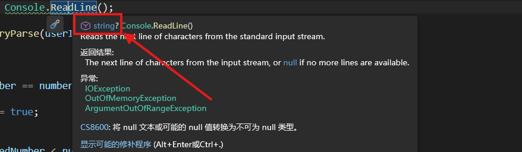

# ⭐ 1.6 空值和模式匹配

## 可空类型

在上一节，使用`Console.ReadLine()`的时候引发了两个警告：

- :warning: CS8600：将 null 文本或可能的 null 值转换为不可为 null 类型。
- :warning: CS8602：解引用可能出现空引用。

当时说暂时忽略它们，要是有强迫症的话，你一定早就看它们不顺眼了。现在我们就来动手解决吧。

将鼠标指针停留在`ReadLine()`方法上，检查一下IntelliSense提示：



原来这个方法的返回值的类型是`string?`。为什么有个问号？难道它也不确定返回的是不是字符串？

在某个类型名称后面加一个问号，会让这个类型变成可为null类型，或者说可空类型（nullable types）。null是什么意思？就是“没有”、“空”的意思！

null是空字符串吗？

``` cs
if (null == string.Empty)
{
    Console.WriteLine("This will never be printed.");
}
else
{
    Console.WriteLine("This will always be printed.");
}
```

很明显不是。如果`string`实例是杯子的话，`string.Empty`就是空杯子，而`null`表示根本没有杯子。同理，null是0吗？也不是。0就是数字0，null是没有数字的意思。

我们这就来声明一些可空变量玩玩：

``` cs
string? nullableString = null;
nullableString = "I'm not null anymore!";
nullableString = null;

int? nullableInt = null;
nullableInt = 100;
nullableInt = null;
```

真不错！普通类型变成可空类型之后，它们的值就能是`null`了。那这有什么用呢？

有一大用处是用`null`来作为初始值或者默认值。我们上一节不是搞了一个[猜数字游戏](./L1_05_3.md/#猜数字游戏)嘛？当时我们设计了一个布尔变量`isGuessed`来表示玩家有没有赢，并且给它定的默认值是`false`对不对？

假如把这个游戏做成web应用，就会有用户明明猜中了数字，但因为网络原因没能把`isGuessed`设置成`true`的可能性。假如`isGuessed`在赢（`true`）和输（`false`）之外有第三个选择`null`，用来表示“胜负未定”的状态不就能改善这个问题吗？

``` cs
bool? isGuessed = null;
```

第二个用处是，我们本来期望某项操作产出一个东西，但是有失败的风险。因此我们可以把这个操作的返回值设置为可空类型，万一操作失败了就返回`null`作为保底，避免直接抛出错误。而我们也可以通过检查产物是不是`null`来知晓操作究竟有没成功。发现了吗？`Console.ReadLine()`不正是这样吗！

### 可空类型与原类型之间的转换

对于原类型来说，可空类型虽然是亲戚，但毕竟不是一家人，不进一家门：

``` cs
double? nullableDouble = 2.71;
double normalDouble = nullableDouble;
```

❌CS0266：无法将类型“double?”隐式转换为“double”。存在一个显式转换(是否缺少强制转换?)

是的，又回到[隐式转换](./L1_02.md/#隐式转换)了。复习一下：范围小的能隐式转换为范围大的，对吧？可空类型比原类型的表达范围多了一个`null`，因此可空类型不能隐式转换为原类型。而反过来就可以：

``` cs
double normalDouble = 2.71;
double? nullableDouble = normalDouble;
```

为什么`string?`转换为`string`不是引发错误，而是警告？噢~它终于露出马脚了。本章介绍的所有类型都是“值类型”，只有`string`类型是例外——它是披着值类型皮的“引用类型”。我们先不深究什么是“值类型”，什么是“引用类型”。

但是提示一下，“数值类型”（numeric types）和“值类型”（value types）是两个概念，前者是数字，包括[整数类型](./L1_01.md)和[浮点数类型](./L1_02.md)。

行。那怎么安全地把可空类型转换为原类型呢？对于值类型，我们有三板斧：`HasValue`、`Value`、`GetValueOrDefault()`。前两个不带括号`()`，是实例属性；最后一个带括号，是实例方法。

让我们以字符为值类型的代表。先创建一个可空字符实例：

``` cs
char? nullable = null;
```

由于我们不知道它是空的还是存有字符，所以先用`HasValue`来做个判断：

``` cs
char? nullable = null;

if (nullable.HasValue)
{
    Console.WriteLine("它不是空的");
}
else
{
    Console.WriteLine("它是空的");
}
```

如果它不是空的，那我们就可以用`Value`来获取它的值，把值安全地赋予`char`类型的变量`result`。万一是空的呢？我们可以提前给`result`设定一个初始值，假如可空变量是空的就继续用初始值好了：

``` cs
char? nullable = null;
char result = '\0'; // 设置初始值

if (nullable.HasValue)
{
    Console.WriteLine("它不是空的");
    result = nullable.Value;
}
else
{
    Console.WriteLine("它是空的");
}
```

上面方法虽然麻烦了一点，但好处是我们可以自由设置变量的初始值。如果想一步到位，可以用`GetValueOrDefault()`方法。顾名思义，如果可空变量不是空的就获取它的值，反之返回原类型的默认值。

下面的列表给出了目前我们学过的各种类型的默认值，它们都是固定的：

|类型|默认值|
|---|------|
|数值类型|`0`|
|bool类型|`false`|
|char类型|`'\0'`|
|引用类型（包括`string`）|`null`|

!!! note

    注意`string`类型的默认值是`null`，而不是`string.Empty`。

重申：虽然上表把引用类型也列进去了，但刚刚说的三板斧是针对值类型的。你可以发现`string?`类型根本不支持`HasValue`、`Value`或`GetValueOrDefault()`。

对于可空字符串类型，我们使用静态方法`string.IsNullOrEmpty()`来判断它是否为`null`或`string.Empty`。类似的方法还有判断是否为`null`或者空格的`string.IsNullOrWhiteSpace()`。

别绕晕了！注意它们是静态方法，和`string`类型绑定。但它们判断的对象是`string?`类型的实例：

``` cs
string? a = null;

if (string.IsNullOrEmpty(a))
{
    Console.WriteLine("a is null or empty.");
}
```

!!! tip

    在字符串[连接](./L1_05.md/#连接字符串)、[内插](./L1_05.md/#字符串内插)操作中，C# 编译器将`null`字符串视为空字符串`""`进行处理。

## 与可空性有关的运算符

### 空包容运算符

可空性是一个让人又爱又恨的功能。一方面，它给我们提供了一个绝佳的表示值缺失、状态异常等意图的工具；另一方面，它也让各种警告和错误常驻你的错误列表。

有时候，让人抓狂的是“明明这个实例非空，但编译器硬说它可能是空值”。遇到这种情况，在经过仔细确认实例的确不可能是`null`的时候，可以在实例名称的末尾加一个感叹号`!`，告诉编译器这个实例真的不是`null`。

``` cs
string? maybeNull = Console.ReadLine();
string absoluteNotNull = maybeNull!;
int len = maybeNull!.Length;
```

本来可空的`maybeNull`赋值给`absoluteNotNull`必然会引发警告“将 null 文本或可能的 null 值转换为不可为 null 类型”。但是加上感叹号，也就是空包容运算符以后，编译器也就不再追究这个问题，而是选择相信你的判断。

当然，要是被你断言不可能为空的实例真的为空了，就准备好接受NullReferenceException等运行时错误的拷打吧！

!!! note

    请注意区分空包容运算符（位于可空实例末尾）和逻辑取反运算符（位于布尔类型实例的前面）。

### 空合并运算符

检查可空实例是否为空，如果非空就取它的值，如果是空的就用备用值。这是一个可空变量的高频使用场景。我们刚才一直在用if-else语句，不如试一下三元表达式吧：

``` cs
// 值类型
char? nullable = null;
char result1 = nullable.HasValue ? nullable.Value : '\0';

// 引用类型
string? input = Console.ReadLine();
string result2 = (!string.IsNullOrEmpty(input)) ? input : "";
```

值类型和引用类型都可以通过与`null`做相等/不相等关系运算判断是否为空：

``` cs
// 值类型
char? nullable = null;
char result1 = (nullable != null) ? nullable.Value : '\0';

// 引用类型
string? input = Console.ReadLine();
string result2 = (input != null) ? input : "";
```

而且，三元表达式还能继续简化为空合并表达式，真可谓语法糖的语法糖：

``` cs
// 值类型
char? nullable = null;
char result1 = nullable ?? '\0';

// 引用类型
string? input = Console.ReadLine();
string result2 = input ?? "";
```

空合并运算符`??`是一个二元运算符。`A ?? B`表示，如果`A`不是空的，就返回`A`；否则返回`B`。通常`A`是可能为空的值，`B`是其备用值。

空合并运算符也支持[复合赋值](./L1_02_1.md/#复合赋值)。回忆一下，`a += 2`就是`a = a + 2`的意思。类推过来，`A ??= B`就应该是`A = A ?? B`。也就是说，先判断`A`是不是空的，如果不是，就把`A`赋值给`A`——原地TP，什么也没做；否则把`B`赋值给`A`。

#### 测验时间

每次讲到语法糖，都是先展示复杂的语法，再介绍简化后的语法。这次我们反过来，请把`A ??= B`还原为if-else语句。

??? question "查看答案"

    ``` cs
    if (A == null)
    {
        A = B;
    }
    ```

### 条件访问和条件索引

https://learn.microsoft.com/zh-cn/dotnet/csharp/nullable-references
https://learn.microsoft.com/zh-cn/dotnet/csharp/nullable-migration-strategies


## 模式匹配

is和as运算符
https://learn.microsoft.com/zh-cn/dotnet/csharp/fundamentals/functional/pattern-matching
类型转换：https://learn.microsoft.com/zh-cn/dotnet/csharp/programming-guide/types/casting-and-type-conversions
https://learn.microsoft.com/zh-cn/dotnet/csharp/fundamentals/tutorials/safely-cast-using-pattern-matching-is-and-as-operators
https://learn.microsoft.com/en-us/dotnet/csharp/language-reference/operators/patterns#declaration-and-type-patterns 声明模式、类型模式

## 联合类型

!!! warning

    联合类型是C# 15中的新功能。如果你使用的.NET版本低于.NET 11，则此功能不可用。

https://learn.microsoft.com/zh-cn/dotnet/csharp/whats-new/csharp-15 联合类型
